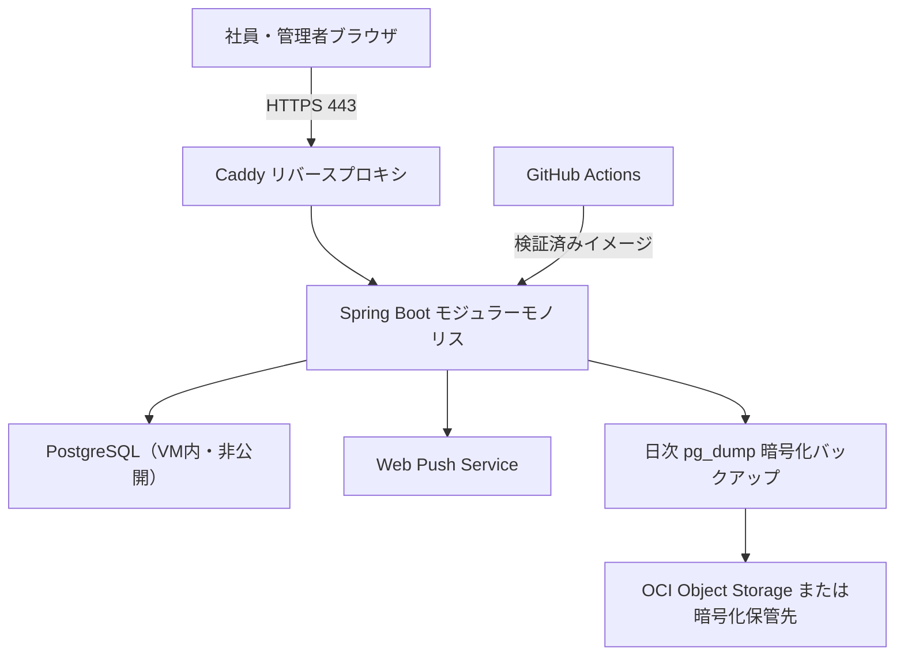

# Clokka アーキテクチャ設計（Phase 2 レビュー版）

| 項目 | 内容 |
| --- | --- |
| 目的 | 50名規模の勤怠管理を、安全かつ低運用負荷で無料運用する論理・配置アーキテクチャを定義する。 |
| 対象読者 | プロダクトオーナー、開発者、運用管理者、セキュリティレビュー担当者 |
| 更新タイミング | 技術選定、ネットワーク、データ境界、可用性・バックアップ方針を変更する時 |
| 状態 | レビュー・承認待ち |
| 最終更新日 | 2026-08-04 |

## 1. 決定概要

**Oracle Cloud Always Free の単一VM上に、Caddy、Spring Boot、PostgreSQLをDocker Composeで配置するモジュラーモノリス**を採用候補とする。フロントエンドは`frontend/`で管理するHTML/CSS/JavaScriptをビルド時にSpring Bootの静的リソースへ同梱し、同一オリジンで提供する。

この構成は、指定されたSpring Boot構成を守りつつ、50名規模に不要な分散システム・CORS・複数課金先を避ける。OCIのAlways Freeリソースはホームリージョンに作成する必要があり、無料枠の容量不足が起こり得るため、作成可否をPhase 5の配備前提条件とする。[Oracle Free Tier](https://docs.oracle.com/en-us/iaas/Content/FreeTier/freetier.htm)

## 2. コンポーネント責務

| コンポーネント | 責務 | 境界 |
| --- | --- | --- |
| ブラウザUI | 入力、表示、通知許諾、アクセシブルな操作 | 認可判断・勤務時間の確定は行わない |
| Caddy | TLS終端、HTTP→HTTPS転送、Spring Bootへのプロキシ | DBや勤怠情報に直接アクセスしない |
| Spring Boot | 認証・認可、業務ルール、REST API、Excel出力、監査、定時通知、静的配信 | DB接続はこのプロセスのみ |
| PostgreSQL | 勤怠・ユーザー・提出・監査の永続化 | インターネットへポート公開しない |
| バックアップ | 日次ダンプ、暗号化、復元可能性の確認 | 本番DBを直接編集しない |
| GitHub Actions | テスト・静的解析・イメージ作成 | 本番Secretsは原則保持しない |

## 3. 設計原則

1. **同一オリジン**: UIとAPIを1つのHTTPSドメインから提供し、CORSとトークンのブラウザ保存を不要にする。
2. **モジュラーモノリス**: `identity`、`attendance`、`submission`、`admin`、`export`、`notification`、`audit`をパッケージ境界に分けるが、初期は1デプロイ単位とする。
3. **DB非公開**: PostgreSQLはDocker内部ネットワークだけで待ち受ける。外部からのDB接続を許可しない。
4. **失敗しても提出状態を壊さない**: 打刻・提出・差戻し・監査ログを1トランザクションで処理し、通知は後続の再試行可能な処理とする。
5. **秘密情報をソースに置かない**: パスワード、VAPID鍵、DB接続情報は環境変数またはOCI Secretへ置く。

## 4. 配置・可用性方針

| 項目 | 方針 |
| --- | --- |
| VM | OCI Always Free A1 Flexを第一候補とし、ARM64互換イメージを作る。容量不足時はAMD MicroまたはCloudflare Workers+D1への移行を再評価する。 |
| 公開ポート | 80（HTTPS転送）と443のみ。SSHは管理者IPまたはOCI Bastion等に制限する。 |
| TLS | Caddyの自動証明書更新を使用する。独自ドメイン費用は無料要件に含めないため、無料で利用可能なホスト名をPhase 5で確認する。 |
| 稼働 | Docker Composeの再起動ポリシーとOS起動時自動開始を設定する。 |
| 監視 | `/actuator/health`、コンテナログ、バックアップ実行結果を確認する。外部死活監視は無料条件を確認後に追加する。 |
| バックアップ | 日次の暗号化`pg_dump`、四半期ごとの復元テスト。RPO 24時間、RTO 24時間。 |

## 5. 将来の拡張・移行境界

| 変更要因 | 拡張方法 |
| --- | --- |
| 利用者増加 | PostgreSQLをマネージドDBへ移し、Spring Bootを別VM/コンテナへ分離する。API契約は維持する。 |
| 高可用性が必要 | DBバックアップに加えレプリカ・複数アプリインスタンス・ロードバランサーを導入する（無料要件とは両立しない可能性が高い）。 |
| OCIが使えない | UIは維持し、APIをCloudflare Workers、DBをD1へ移植する。SQL・認証・通知実装の書換えが必要。 |
| 休暇機能追加 | `leave`モジュールを追加し、勤怠未入力判定へ休暇状態を統合する。 |

## 6. リスクと対策

| リスク | 影響 | 対策 |
| --- | --- | --- |
| OCI無料VMの容量不足・条件変更 | 配備不能・停止 | Phase 5で作成検証、バックアップ、Cloudflare移行案を保持する。 |
| 単一VM障害 | 一時的に全機能停止 | 自動再起動、日次バックアップ、復元手順、RTO/RPOを運用文書で検証する。 |
| Push拒否 | 能動リマインドが届かない | アプリ内警告・管理者未提出一覧を提供し、外部連絡運用はPhase 11までに決定する。 |
| VM侵害 | 個人情報漏えい | パッチ適用、最小公開ポート、非root実行、秘密情報分離、監査ログ、バックアップ暗号化。 |

## 7. 承認後の次工程

本構成と`03_tech-stack.md`の技術選定を承認後、Phase 3でDB、API、画面、セキュリティの詳細設計を行う。承認前にアプリケーションコードやクラウド環境は作成しない。

