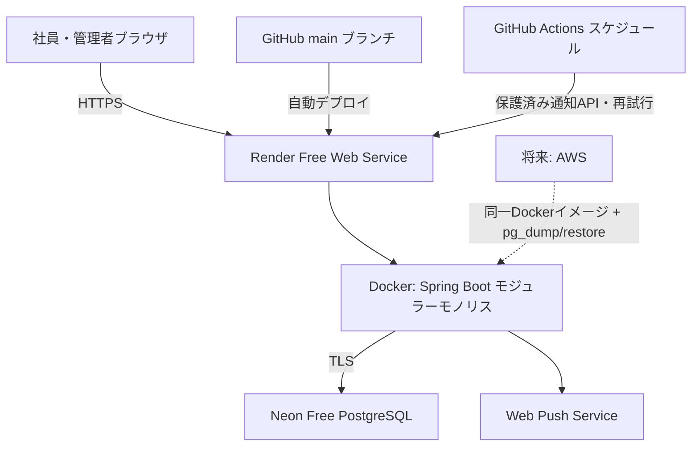

# Clokka アーキテクチャ設計（Phase 2 レビュー版）

| 項目 | 内容 |
| --- | --- |
| 目的 | 50名規模の勤怠管理を、安全かつ低運用負荷で無料運用する論理・配置アーキテクチャを定義する。 |
| 対象読者 | プロダクトオーナー、開発者、運用管理者、セキュリティレビュー担当者 |
| 更新タイミング | 技術選定、ネットワーク、データ境界、可用性・バックアップ方針を変更する時 |
| 状態 | レビュー・承認待ち |
| 最終更新日 | 2026-08-04 |

## 1. 決定概要

**Render Free Web Service上のDocker化したSpring Bootと、Neon FreeのPostgreSQLを組み合わせるモジュラーモノリス**を、会社提出用MVPの稼働環境として採用する。フロントエンドは`frontend/`で管理するHTML/CSS/JavaScriptをビルド時にSpring Bootの静的リソースへ同梱し、同一オリジンで提供する。

RenderはGitHubリポジトリのDockerfileからイメージをビルドでき、無料Web Serviceは15分無通信で停止する。[Render Docker](https://render.com/docs/docker) [Render Free](https://render.com/docs/free) 永続DBには、30日で失効するRender Free Postgresではなく、クレジットカード不要・期限なしのNeon Free PostgreSQLを使う。[Neon Pricing](https://neon.com/pricing) 指定構成を守りつつ、50名規模に不要な分散システム・CORSを避け、AWSを含む任意のDocker実行環境へ移行可能にする。

## 2. コンポーネント責務

| コンポーネント | 責務 | 境界 |
| --- | --- | --- |
| ブラウザUI | 入力、表示、通知許諾、アクセシブルな操作 | 認可判断・勤務時間の確定は行わない |
| Render | GitHub連携のDockerビルド・HTTPS終端・Web公開 | 勤怠業務・認可判断・DBスキーマを持たない |
| Spring Boot | 認証・認可、業務ルール、REST API、Excel出力、監査、定時通知、静的配信 | DB接続はこのプロセスのみ |
| Neon PostgreSQL | 勤怠・ユーザー・提出・監査の永続化 | 接続文字列はRender環境変数にのみ置く |
| GitHub Actions | テスト・静的解析、月次リマインドAPIの起動 | Render/Neon接続情報をログに出さない |

## 3. 設計原則

1. **同一オリジン**: UIとAPIを1つのHTTPSドメインから提供し、CORSとトークンのブラウザ保存を不要にする。
2. **モジュラーモノリス**: `identity`、`attendance`、`submission`、`admin`、`export`、`notification`、`audit`をパッケージ境界に分けるが、初期は1デプロイ単位とする。
3. **DB非公開**: PostgreSQLはDocker内部ネットワークだけで待ち受ける。外部からのDB接続を許可しない。
4. **失敗しても提出状態を壊さない**: 打刻・提出・差戻し・監査ログを1トランザクションで処理し、通知は後続の再試行可能な処理とする。
5. **秘密情報をソースに置かない**: パスワード、VAPID鍵、DB接続情報はRender環境変数・GitHub Actions Secretsへ置き、Gitへコミットしない。

## 4. 配置・可用性方針

| 項目 | 方針 |
| --- | --- |
| MVP配備 | Render Free Web Serviceへ、`main`へのpushをトリガーとしてDockerfileから自動デプロイする。Renderが提供するHTTPS URLを使用する。 |
| DB | Neon Free PostgreSQLへTLS接続する。Render Free Postgresは30日で失効しバックアップ非対応のため、MVPの永続DBとして不採用とする。[Render Free](https://render.com/docs/free) |
| 定時通知 | Renderの停止中はアプリ内スケジューラが動かないため使用しない。GitHub Actionsのスケジュール実行から、共有シークレットで保護した通知APIを呼び出し、失敗時は再試行する。これはMVPのベストエフォート通知であり、管理者の未提出・Push拒否一覧を正とする。 |
| データ取扱い | 会社の承認・委託先確認前のMVPには実在社員の個人情報を投入せず、ダミーデータのみ使用する。 |
| 本番配備 | 導入決定後に会社名義のAWS等を選定する。AWSへは同一DockerイメージをECSまたはEC2へ配置し、Neonから`pg_dump`/`pg_restore`でRDS PostgreSQL等へ移行する。AWS料金は別途承認対象とし、無料を前提にしない。 |
| 監視・バックアップ | MVPではRender/Neonの管理画面と`/actuator/health`を確認する。本番では日次暗号化バックアップ、復元テスト、RPO 24時間・RTO 24時間を必須とする。 |

## 5. 将来の拡張・移行境界

| 変更要因 | 拡張方法 |
| --- | --- |
| 利用者増加 | PostgreSQLをマネージドDBへ移し、Spring Bootを別VM/コンテナへ分離する。API契約は維持する。 |
| 高可用性が必要 | DBバックアップに加えレプリカ・複数アプリインスタンス・ロードバランサーを導入する（無料要件とは両立しない可能性が高い）。 |
| AWSへ本番移行 | 同一DockerイメージをECSまたはEC2へ配置し、PostgreSQLダンプ/リストアでDBをRDSへ移行する。Caddy/ALB、Secrets Manager、EventBridge等のAWS管理サービスは移行時に導入可否を判断する。Spring Boot APIとUIの契約は維持する。 |
| 別クラウドへ移行 | Docker Compose、REST API、PostgreSQL標準SQL、環境変数を維持する。クラウド固有の通知・認証・DB機能を使わないため、主な作業はインフラ定義とSecretsの再設定になる。 |
| 休暇機能追加 | `leave`モジュールを追加し、勤怠未入力判定へ休暇状態を統合する。 |

## 6. リスクと対策

| リスク | 影響 | 対策 |
| --- | --- | --- |
| Render Freeの停止・再起動 | 初回応答が遅い、定時処理が常時動かない | MVP用途に限定し、通知はGitHub Actions起動＋管理者一覧で補完する。本番利用前に会社承認済みの配備先へ移行する。 |
| Render Free Postgresの失効 | データ消失 | Neon Free PostgreSQLを使用し、MVPにはダミーデータのみ投入する。 |
| クラウド移行時のコスト増 | 予算超過 | クラウド選定時に月額上限、監視、停止手順を承認する。AWSは無料前提にしない。 |
| 単一VM障害 | 一時的に全機能停止 | 自動再起動、日次バックアップ、復元手順、RTO/RPOを運用文書で検証する。 |
| Push拒否 | 能動リマインドが届かない | 管理者ページで許可・拒否・未設定・非対応・未確認を一覧・絞込みできるようにし、拒否者を把握する。 |
| VM侵害 | 個人情報漏えい | パッチ適用、最小公開ポート、非root実行、秘密情報分離、監査ログ、バックアップ暗号化。 |

## 7. 承認後の次工程

本構成と`03_tech-stack.md`の技術選定を承認後、Phase 3でDB、API、画面、セキュリティの詳細設計を行う。承認前にアプリケーションコードやクラウド環境は作成しない。
