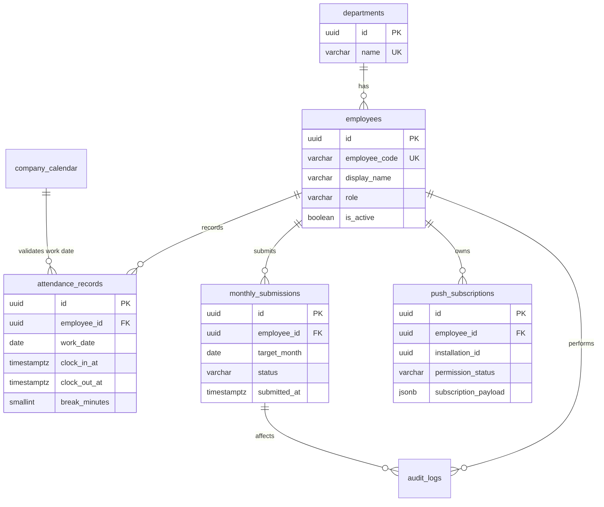

# Clokka データベース設計（Phase 3 レビュー版）

| 項目 | 内容 |
| --- | --- |
| 目的 | 勤怠・月次提出・通知・監査を矛盾なく保持するPostgreSQL論理設計を定義する。 |
| 対象読者 | 開発者、テスト担当者、運用管理者、レビュー担当者 |
| 更新タイミング | エンティティ、制約、インデックス、保持方針を変更する時 |
| 状態 | レビュー・承認待ち |
| 最終更新日 | 2026-08-06 |

## 1. 設計方針

- 主キーはUUID、業務上の日時は`TIMESTAMPTZ`、勤務日は`DATE`を用いる。
- 勤務日の基準は必ず出勤時刻のJST日付とし、日跨ぎでも`work_date`は変えない（`D-01`）。
- 提出済み月の勤怠を直接更新・削除しない。差戻し後のみ更新を許可する。
- 時刻・状態の整合性はDB制約とアプリケーションの両方で検証する。
- スキーマ変更はFlyway OSSの連番SQLマイグレーションだけで実施する。

## 2. ER図

## 3. テーブル定義

| テーブル | 主な列・制約 | 目的 |
| --- | --- | --- |
| `departments` | `id`, `name UNIQUE`, `is_active` | 部署マスタ。削除ではなく無効化する。 |
| `employees` | `id`, `employee_code UNIQUE`, `display_name`, `password_hash`, `role CHECK ('EMPLOYEE','ADMIN')`, `department_id`, `is_active`, `last_login_at` | 認証・権限・社員表示。パスワード平文は保持しない。 |
| `attendance_records` | `id`, `employee_id`, `work_date`, `clock_in_at`, `clock_out_at`, `break_minutes`, `note`, `created_at`, `updated_at`, `UNIQUE(employee_id, work_date)` | 1社員・1勤務日の勤怠。複数回出退勤は初期対象外。 |
| `monthly_submissions` | `id`, `employee_id`, `target_month`（月初日）, `status CHECK ('DRAFT','SUBMITTED','RETURNED')`, `submitted_at`, `returned_at`, `return_reason`, `updated_at`, `UNIQUE(employee_id, target_month)` | 月次提出の状態・時刻・差戻し理由。 |
| `company_calendar` | `calendar_date UNIQUE`, `kind CHECK ('HOLIDAY','WORKDAY_OVERRIDE')`, `name` | 会社休日と休日出勤日の例外設定。 |
| `push_subscriptions` | `id`, `employee_id`, `installation_id UUID`, `endpoint UNIQUE`, `p256dh`, `auth_secret`, `permission_status CHECK ('GRANTED','DENIED','DEFAULT','UNSUPPORTED','UNKNOWN')`, `last_reported_at`, `revoked_at`, `UNIQUE(employee_id, installation_id)` | ブラウザ設置単位のPush購読と許可状態。`GRANTED`は有効な購読登録がある端末だけに使う。管理画面は社員単位に集約する。 |
| `audit_logs` | `id`, `actor_employee_id`, `action`, `target_type`, `target_id`, `before_data JSONB`, `after_data JSONB`, `created_at`, `request_id` | 更新・提出・差戻し・出力・権限変更の追跡。 |

## 4. 主要制約・計算

| 対象 | ルール |
| --- | --- |
| `work_date` | `clock_in_at AT TIME ZONE 'Asia/Tokyo'`の日付と一致する。 |
| 出退勤 | `clock_out_at > clock_in_at`、かつ経過時間は24時間未満。入力時に退勤時刻が出勤時刻以下なら翌日の退勤としてJSTで補正する。 |
| 休憩 | `break_minutes >= 0`かつ、出勤から退勤までの総分未満。 |
| 勤務時間 | `(clock_out_at - clock_in_at) - break_minutes`。DBへ冗長保存せず、読取時またはExcel出力時に計算する。 |
| 提出対象 | `company_calendar`の`HOLIDAY`を除いた平日を既定の対象日とする。`WORKDAY_OVERRIDE`は土日でも対象日にする。 |
| 提出可否 | 対象日に勤怠が存在し、出退勤・休憩制約を満たすこと。休暇は初期リリースで未実装のため、未入力例外にはならない（`D-03`）。 |
| 編集可否 | 当月の`monthly_submissions.status`が`SUBMITTED`なら社員更新を拒否する。`RETURNED`または`DRAFT`のみ許可する。 |

### `monthly_submissions`レコードの作成タイミング

月初に全社員分を一括作成せず、**対象月で最初に勤怠を保存した時**に、勤怠レコードと同一トランザクションで`DRAFT`レコードを作成する。対象月の提出操作時にレコードが未作成なら、まず提出前チェックを行う。チェックが失敗した場合はレコードを作成せず`422`を返し、成功した場合だけ同一トランザクションで`SUBMITTED`レコードを作成する。

まだ勤怠も提出も行っておらずレコードが存在しない社員は、社員画面・管理画面では`DRAFT`（未提出・未入力）として扱う。管理一覧は`employees`を起点に`monthly_submissions`をLEFT JOINし、レコード未作成の社員を欠落させない。`GET`での画面表示はDBを書き換えない。

| 操作 | `monthly_submissions`の扱い |
| --- | --- |
| 月次画面を表示するだけ | 作成しない。未作成は画面上`DRAFT`として表示する。 |
| 対象月で初めて勤怠を保存する | `DRAFT`を作成し、勤怠保存と同時に確定する。 |
| 未作成のまま提出する | 提出前チェックが失敗した場合は作成しない。成功時だけ`SUBMITTED`レコードを作成する。通常月の勤怠なし提出は未入力として`422`になる。 |
| 管理者が一覧を見る | 作成しない。未作成社員も`DRAFT`として一覧に含める。 |
| 管理者が差戻す | `SUBMITTED`レコードだけを`RETURNED`へ変更する。 |

## 5. インデックスと保持

| テーブル | インデックス | 理由 |
| --- | --- | --- |
| `attendance_records` | `(employee_id, work_date)` UNIQUE、`(work_date)` | 月次一覧・管理者集計を高速化。 |
| `monthly_submissions` | `(target_month, status)`、`(employee_id, target_month)` UNIQUE | 未提出一覧と社員の月次状態取得。 |
| `employees` | `employee_code` UNIQUE、`(department_id, is_active)` | ログイン・部署フィルタ。 |
| `push_subscriptions` | `(employee_id, permission_status)` | 通知拒否社員の集約。 |
| `audit_logs` | `(target_type, target_id, created_at DESC)`、`(actor_employee_id, created_at DESC)` | 調査・監査画面。 |

`audit_logs`は更新不可とする。退職者を無効化しても勤怠・提出・監査履歴は削除しない。

### 複数端末の判定方法

Clokkaは端末固有情報・広告ID・ブラウザフィンガープリントを収集しない。通知設定画面を初めて開いたブラウザごとに、JavaScriptの`crypto.randomUUID()`で`installation_id`を生成し、そのブラウザのローカルストレージに保存する。通知状態やPush購読を報告する際には、ログイン済み社員IDとこの`installation_id`を必ず送る。

同一社員に対して有効な`installation_id`が複数あれば、「複数端末（正確には複数のブラウザ設置）」として集約する。例として、同じ社員がiPhoneのSafariと会社PCのChromeで通知設定を行うと2件になる。同じブラウザでPush endpointが更新された場合は、同じ`installation_id`の行を更新するため、端末数は増えない。ローカルストレージ削除・ブラウザ再インストール後は新しい設置として扱い、古い購読はPush送信の失敗（410/404）時に`revoked_at`を設定して無効化する。

社員単位のPush状態は、端末ごとの`push_subscriptions`から集約する。1件でも有効な`GRANTED`購読があれば`GRANTED`、それ以外は`DENIED`、`DEFAULT`、`UNSUPPORTED`、`UNKNOWN`の優先順で表示する。Push endpoint、鍵、購読ペイロードは管理画面に返さない。

## 6. データ移行・AWS移行

FlywayマイグレーションはRender/Neonと将来のAWS RDS PostgreSQLの双方で実行する。移行時は書込みを止め、`pg_dump --format=custom`と`pg_restore`で移送し、件数・月次提出数・監査ログ件数を照合する。

| ID | 内容 | 状態 |
| --- | --- | --- |
| R-03 | 実社員データの保持期間・退職後の削除基準は未定。初期は社員を無効化し履歴を削除しない。正式運用開始前に会社の規程に基づく保持・削除方針を追加する。 | 受容済み・Phase 10前に再確認 |

