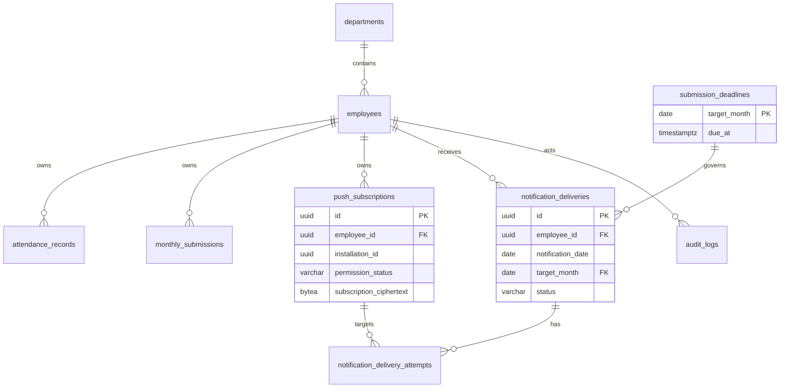

# Clokka Database Design (Phase 3 review)

| Item | Value |
| --- | --- |
| Purpose | Define a PostgreSQL design that keeps attendance, monthly submission, deadlines, notification delivery, Push subscriptions, and audit data consistent. |
| Status | Review pending approval. No migration has been executed. |
| Last updated | 2026-08-26 |

## 1. Design decisions

- UUID is used for primary keys. Business instants use `TIMESTAMPTZ`; JST business dates and months use `DATE`.
- A work date is always the JST date of `clock_in_at`. Overnight work remains in its clock-in month (`D-01`).
- `submission_deadlines` is the source of truth for each target month. Its `due_at` is an instant, while its business interpretation and default are JST.
- The notification job provides **at-most-once delivery attempt per employee and JST date**. It commits a durable reservation before contacting a Push service. This deliberately favors no duplicate Push over retrying a potentially already-delivered Push after a process failure.
- A Push subscription is one browser installation. The complete Web Push subscription object is encrypted as one opaque payload; endpoint and keys are never stored or indexed in plaintext.
- Foreign keys, `NOT NULL`, `CHECK`, unique constraints, restricted database roles, and immutable-log triggers protect invariants. Application validation remains responsible for authorization, calendar-derived target days, and cross-row submission checks.
- Schema changes are Flyway versioned SQL migrations only. The DDL below is a required implementation contract for Phase 6/7, not an executed migration.

## 2. ER diagram



## 3. Table and relationship contract

All `created_at` and `updated_at` values are `TIMESTAMPTZ NOT NULL`. `created_at` is immutable; `updated_at` is written by the application in the same transaction.

| Table | Required columns and constraints | Foreign key / deletion rule |
| --- | --- | --- |
| `departments` | `id UUID PK`, `name VARCHAR(100) NOT NULL UNIQUE`, `is_active BOOLEAN NOT NULL DEFAULT true`, timestamps | Departments are deactivated, not deleted. `employees.department_id` uses `ON DELETE RESTRICT`. |
| `employees` | `id UUID PK`, `employee_code VARCHAR(64) NOT NULL UNIQUE`, `display_name VARCHAR(200) NOT NULL`, `password_hash VARCHAR(255) NOT NULL`, `role VARCHAR(16) NOT NULL CHECK ('EMPLOYEE','ADMIN')`, `department_id UUID NOT NULL`, `is_active BOOLEAN NOT NULL DEFAULT true`, `last_login_at TIMESTAMPTZ NULL`, timestamps | Employees are deactivated, not deleted. Dependent business data uses `ON DELETE RESTRICT`. |
| `attendance_records` | `id UUID PK`, `employee_id UUID NOT NULL`, `work_date DATE NOT NULL`, `clock_in_at TIMESTAMPTZ NOT NULL`, `clock_out_at TIMESTAMPTZ NOT NULL`, `break_minutes SMALLINT NOT NULL DEFAULT 0`, `note VARCHAR(2000) NOT NULL DEFAULT ''`, timestamps, `UNIQUE(employee_id, work_date)` | `employee_id REFERENCES employees(id) ON DELETE RESTRICT`. |
| `monthly_submissions` | `id UUID PK`, `employee_id UUID NOT NULL`, `target_month DATE NOT NULL`, `status VARCHAR(16) NOT NULL`, `submitted_at TIMESTAMPTZ NULL`, `returned_at TIMESTAMPTZ NULL`, `return_reason VARCHAR(2000) NULL`, timestamps, `UNIQUE(employee_id, target_month)` | `employee_id REFERENCES employees(id) ON DELETE RESTRICT`. |
| `company_calendar` | `calendar_date DATE PK`, `kind VARCHAR(20) NOT NULL CHECK ('HOLIDAY','WORKDAY_OVERRIDE')`, `name VARCHAR(200) NOT NULL`, timestamps | This is an exception calendar; no attendance FK is used because target-day calculation is derived from calendar rules. Calendar entries referenced by a submission must not be physically deleted; administrative deletion is out of scope for the API. |
| `submission_deadlines` | `target_month DATE PK`, `due_at TIMESTAMPTZ NOT NULL`, `updated_by_employee_id UUID NOT NULL`, timestamps | `updated_by_employee_id REFERENCES employees(id) ON DELETE RESTRICT`; `notification_deliveries.target_month` uses `ON DELETE RESTRICT`. |
| `push_subscriptions` | `id UUID PK`, `employee_id UUID NOT NULL`, `installation_id UUID NOT NULL`, `permission_status VARCHAR(16) NOT NULL`, encrypted-payload columns described below, `last_reported_at TIMESTAMPTZ NOT NULL`, `revoked_at TIMESTAMPTZ NULL`, `revocation_reason VARCHAR(32) NULL`, timestamps, `UNIQUE(employee_id, installation_id)` | `employee_id REFERENCES employees(id) ON DELETE RESTRICT`. Rows are never deleted by the application. |
| `notification_deliveries` | `id UUID PK`, `employee_id UUID NOT NULL`, `notification_date DATE NOT NULL`, `target_month DATE NOT NULL`, `reminder_stage VARCHAR(16) NOT NULL`, `status VARCHAR(24) NOT NULL`, `reserved_at TIMESTAMPTZ NOT NULL`, `completed_at TIMESTAMPTZ NULL`, `request_id UUID NOT NULL`, timestamps, `UNIQUE(employee_id, notification_date)` | Employee and deadline references use `ON DELETE RESTRICT`. This unique key is the durable at-most-once guard. |
| `notification_delivery_attempts` | `id UUID PK`, `delivery_id UUID NOT NULL`, `push_subscription_id UUID NOT NULL`, `status VARCHAR(24) NOT NULL`, `provider_status_code INTEGER NULL`, `attempted_at TIMESTAMPTZ NOT NULL`, timestamps, `UNIQUE(delivery_id, push_subscription_id)` | `delivery_id REFERENCES notification_deliveries(id) ON DELETE RESTRICT`; `push_subscription_id REFERENCES push_subscriptions(id) ON DELETE RESTRICT`. |
| `audit_logs` | `id UUID PK`, `actor_type VARCHAR(16) NOT NULL`, `actor_employee_id UUID NULL`, `action VARCHAR(64) NOT NULL`, `target_type VARCHAR(64) NOT NULL`, `target_id UUID NULL`, `before_data JSONB NULL`, `after_data JSONB NULL`, `request_id UUID NOT NULL`, `created_at TIMESTAMPTZ NOT NULL` | `actor_employee_id REFERENCES employees(id) ON DELETE RESTRICT` when an actor is an employee. `target_type`/`target_id` are polymorphic and therefore cannot have a database FK; the application must validate them. |

`target_month` is always the first calendar day of the JST target month. `due_at` is stored as an absolute instant. The default deadline for target month `M` is **the third day of `M + 1 month` at 23:59:00 Asia/Tokyo**. The application creates an explicit `submission_deadlines` row with that instant before a month is used by a deadline, submission, or reminder workflow; absence of a row is a configuration error, not a fallback to a hidden default. The API accepts a JST offset timestamp and returns an ISO-8601 instant; the UI displays it in JST.

## 4. PostgreSQL DDL invariants

The following constraints are mandatory in the initial Flyway schema. Column types may be expanded only if the same invariants remain true.

```sql
ALTER TABLE attendance_records
  ADD CONSTRAINT ck_attendance_work_date_jst
    CHECK (work_date = (clock_in_at AT TIME ZONE 'Asia/Tokyo')::date),
  ADD CONSTRAINT ck_attendance_elapsed
    CHECK (clock_out_at > clock_in_at
       AND clock_out_at - clock_in_at < INTERVAL '24 hours'),
  ADD CONSTRAINT ck_attendance_break
    CHECK (break_minutes >= 0
       AND break_minutes < EXTRACT(EPOCH FROM (clock_out_at - clock_in_at)) / 60);

ALTER TABLE monthly_submissions
  ADD CONSTRAINT ck_submission_target_month
    CHECK (target_month = date_trunc('month', target_month)::date),
  ADD CONSTRAINT ck_submission_status_fields
    CHECK (
      (status = 'DRAFT'
        AND submitted_at IS NULL AND returned_at IS NULL AND return_reason IS NULL)
      OR (status = 'SUBMITTED'
        AND submitted_at IS NOT NULL AND returned_at IS NULL AND return_reason IS NULL)
      OR (status = 'RETURNED'
        AND submitted_at IS NOT NULL AND returned_at IS NOT NULL
        AND return_reason IS NOT NULL AND length(btrim(return_reason)) > 0)
    );

ALTER TABLE submission_deadlines
  ADD CONSTRAINT ck_deadline_target_month
    CHECK (target_month = date_trunc('month', target_month)::date);

ALTER TABLE notification_deliveries
  ADD CONSTRAINT ck_notification_stage
    CHECK (reminder_stage IN ('D7','D3','D1','DUE')),
  ADD CONSTRAINT ck_notification_status
    CHECK (status IN ('RESERVED','SENT','SKIPPED','FAILED')),
  ADD CONSTRAINT ck_notification_completed
    CHECK ((status = 'RESERVED' AND completed_at IS NULL)
       OR (status IN ('SENT','SKIPPED','FAILED') AND completed_at IS NOT NULL));

ALTER TABLE notification_delivery_attempts
  ADD CONSTRAINT ck_notification_attempt_status
    CHECK (status IN ('SENT','FAILED','SKIPPED'));

ALTER TABLE audit_logs
  ADD CONSTRAINT ck_audit_actor
    CHECK ((actor_type = 'EMPLOYEE' AND actor_employee_id IS NOT NULL)
       OR (actor_type = 'SYSTEM' AND actor_employee_id IS NULL));
```

The `monthly_submissions` constraint deliberately clears `returned_at` and `return_reason` on re-submission. History is retained in `audit_logs`; `submitted_at` means the timestamp of the current/latest successful submission. The application must allow only `DRAFT -> SUBMITTED`, `SUBMITTED -> RETURNED`, and `RETURNED -> SUBMITTED` transitions, atomically with an audit-log insert.

The attendance submission lock and the calendar-derived set of required days span rows and tables. They are enforced by an application transaction with row locks, after the database constraints above have validated each record. A database trigger may additionally reject attendance writes whose matching submission is `SUBMITTED`, but authorization remains application-owned.

## 5. Deadline and notification delivery

`submission_deadlines` stores one explicit deadline per target month. `PUT /admin/deadlines/{month}` upserts the row; its first creation must use the default JST deadline above unless the administrator supplies a different JST instant. A deadline update is audit logged. The current month and the next 12 target months are provisioned idempotently by an application startup/admin maintenance transaction; existing rows are never overwritten by provisioning.

For `POST /internal/jobs/monthly-reminders`, the job calculates the JST date and eligible stage (`D7`, `D3`, `D1`, or `DUE`) from the persisted `due_at`, selects active non-submitted employees, then performs this sequence per employee:

1. In one transaction, insert a `notification_deliveries` row with `status = 'RESERVED'`, `notification_date` equal to the job's JST date, and the job `request_id`.
2. If `UNIQUE(employee_id, notification_date)` conflicts, do not contact any Push endpoint for that employee that day.
3. Commit the reservation before contacting the Push service. Insert one attempt row for every active `GRANTED` subscription selected for the reserved delivery.
4. Mark the logical delivery `SENT`, `SKIPPED`, or `FAILED` with `completed_at`; a 404/410 endpoint response also invalidates that subscription in the same follow-up transaction.

The reservation is never deleted or retried on the same JST date, including a process crash after reservation. Therefore a crash may cause a missed Push, but cannot make Clokka send a second notification request for that employee/date. This is the strongest practical at-most-once behavior available when the external Web Push provider does not participate in the database transaction. In-app warnings remain available and the administrator list remains the operational fallback.

## 6. Push subscription storage and state

`push_subscriptions` does **not** use `subscription_payload JSONB`; that former ERD field is removed. The subscription JSON `{ endpoint, keys: { p256dh, auth } }` is serialized by the application and encrypted as one payload with AES-256-GCM before it reaches PostgreSQL:

| Column | Rule |
| --- | --- |
| `subscription_ciphertext BYTEA` | Ciphertext including the GCM authentication tag. `NOT NULL` only for active `GRANTED` rows. |
| `subscription_iv BYTEA` | Per-write 96-bit random IV. `NOT NULL` only with ciphertext. |
| `encryption_key_version SMALLINT` | Key identifier, `NOT NULL` only with ciphertext; enables controlled rotation. |
| `permission_status` | `CHECK ('GRANTED','DENIED','DEFAULT','UNSUPPORTED')`. `UNKNOWN` is derived only when no row exists, never stored. |
| `revoked_at`, `revocation_reason` | Retain invalidation history. `revocation_reason` is `USER_UNSUBSCRIBED`, `DELIVERY_GONE`, or `REPLACED`. |

```sql
ALTER TABLE push_subscriptions
  ADD CONSTRAINT ck_push_payload_state
    CHECK (
      (permission_status = 'GRANTED' AND revoked_at IS NULL
       AND subscription_ciphertext IS NOT NULL AND subscription_iv IS NOT NULL
       AND encryption_key_version IS NOT NULL)
      OR (permission_status IN ('DENIED','DEFAULT','UNSUPPORTED')
       AND subscription_ciphertext IS NULL AND subscription_iv IS NULL
       AND encryption_key_version IS NULL)
    ),
  ADD CONSTRAINT ck_push_revocation_reason
    CHECK ((revoked_at IS NULL AND revocation_reason IS NULL)
       OR (revoked_at IS NOT NULL
         AND revocation_reason IS NOT NULL
         AND revocation_reason IN ('USER_UNSUBSCRIBED','DELIVERY_GONE','REPLACED')));
```

The encryption key is a 32-byte random key held only in the Render application environment as `PUSH_SUBSCRIPTION_ENCRYPTION_KEY`; it is never in PostgreSQL, Git, logs, API output, or audit JSON. The application has one current key version and may decrypt with an old version only for rotation. PostgreSQL backups therefore require the corresponding environment-key recovery procedure before restoration is considered complete.

`DELETE /push-subscriptions/{id}` means **revoke**, not physical delete: the authenticated owner row is changed to `DEFAULT`, ciphertext/IV/key-version are cleared, `revoked_at` is set, and an audit log is inserted. A 404/410 provider response follows the same invalidation with `DELIVERY_GONE`. A successful new subscription for the same installation replaces the prior state atomically, clears `revoked_at`, stores new encrypted data, and records an audit event. Current employee-level state is derived from non-deleted rows: active `GRANTED`, then any `DEFAULT`, then all `DENIED`, then all `UNSUPPORTED`, otherwise `UNKNOWN` when no installation has ever reported. Revoked rows count as `DEFAULT`, matching the approved requirements definition.

## 7. Indexes, roles, and immutable audit logs

Required indexes are `attendance_records(employee_id, work_date)`, `attendance_records(work_date)`, `monthly_submissions(target_month, status)`, `employees(department_id, is_active)`, `push_subscriptions(employee_id, permission_status)`, `notification_deliveries(target_month, status)`, `notification_delivery_attempts(delivery_id)`, `audit_logs(target_type, target_id, created_at DESC)`, and `audit_logs(actor_employee_id, created_at DESC)`. Unique keys above provide their own indexes.

The Flyway/migration role (`clokka_owner`) owns tables and triggers. The runtime role (`clokka_app`) is not an owner; it receives only the necessary `SELECT`, `INSERT`, and controlled business-table `UPDATE` privileges. For `audit_logs`, it receives `SELECT, INSERT` only; `PUBLIC` receives no privileges. A trigger is defense in depth:

```sql
CREATE FUNCTION reject_audit_log_mutation() RETURNS trigger
LANGUAGE plpgsql AS $$
BEGIN
  RAISE EXCEPTION 'audit_logs are append-only';
END;
$$;

CREATE TRIGGER trg_audit_logs_immutable
  BEFORE UPDATE OR DELETE ON audit_logs
  FOR EACH ROW EXECUTE FUNCTION reject_audit_log_mutation();
```

The application connection must never use `clokka_owner`. Backup and restore procedures use privileged operational credentials outside normal runtime. Audit entries must exclude plaintext Push data and encryption material.

## 8. Retention and open boundary

Employees, departments, attendance, submissions, Push-installation rows, notification deliveries, and audit logs are not physically deleted during the MVP. `R-03` remains open: the company must approve employee-data and backup retention/deletion periods before Phase 10. The design resolves notification idempotency (`KI-009` / `Q-06`) but does not resolve the separate legal retention-policy decision.
