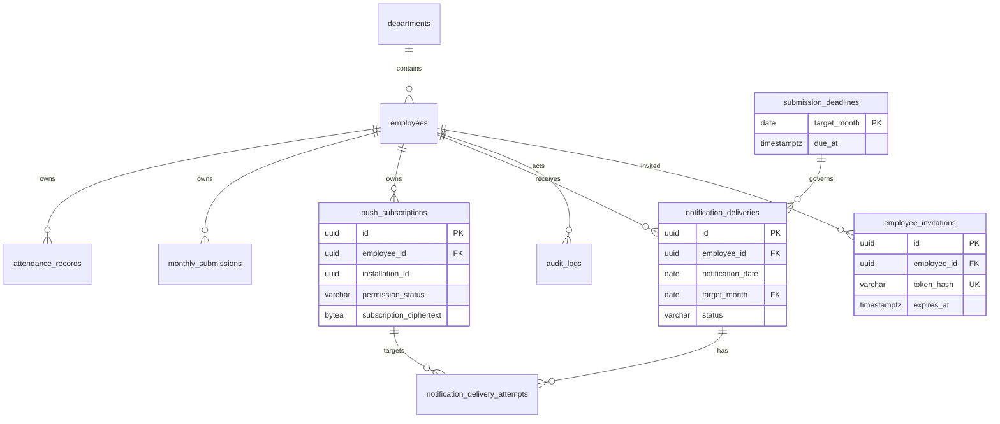

# Clokka データベース設計（Phase 3 承認済み + 2026-08-28追補）

| 項目 | 内容 |
| --- | --- |
| 目的 | 勤怠・月次提出・締切・通知配信・Push購読・監査データを一貫性を保って保持するPostgreSQL設計を定義する。 |
| 状態 | 承認済み（Q-01 2026-08-28）+ 追補 2026-08-28（Bootstrap/招待/最後のADMIN）。マイグレーションは未実行。 |
| 最終更新日 | 2026-08-28 |

## 1. 設計方針

- 主キーはUUID、業務上の瞬間は `TIMESTAMPTZ`、JSTの業務日・対象月は `DATE` を使う。
- 勤務日は常に `clock_in_at` のJST日付とする。日跨ぎ勤務も開始月に属する（`D-01`）。
- `submission_deadlines` が各対象月の締切の正とする。`due_at` は瞬間として保存し、業務上の解釈と既定値はJSTである。
- 通知ジョブは **社員・JST日付ごとに最大1回の配信試行（at-most-once）** を提供する。Pushサービスに連絡する前に永続的な予約をコミットする。これは障害後に重複Pushを再送するよりも、重複を避けることを優先する設計である。
- Push購読はブラウザの1インストールを1行とする。Web Push購読オブジェクト全体は1つの不透明なペイロードとして暗号化し、endpointや鍵を平文で保存・索引付けしない。
- 外部キー、`NOT NULL`、`CHECK`、一意制約、権限を絞ったDBロール、不変ログのトリガで不変条件を保護する。認可、休日由来の対象日、複数行に跨る提出チェック、**招待トークンのライフサイクル、最後の管理者保護（行ロックによるアプリケーション強制、DBのCHECKではない）**はアプリケーション側の責務とする。
- スキーマ変更はFlywayのバージョン管理されたSQLマイグレーションのみで行う。以下のDDLはPhase 6/7の実装契約であり、実行済みのマイグレーションではない。
- **Bootstrapと招待:** 初期 `ADMIN` は `BOOTSTRAP_ADMIN_*` 環境変数から、有効な `ADMIN` が存在しない場合のみ冪等に作成する。社員招待は `employee_invitations` にハッシュ化されたトークン、期限、単回利用の無効化で保持する。`password_hash` を管理者が平文で設定することはない。

## 2. ER図



## 3. テーブル・リレーション契約

すべての `created_at` と `updated_at` は `TIMESTAMPTZ NOT NULL` である。`created_at` は不変、`updated_at` は同一トランザクション内でアプリケーションが書き込む。

| テーブル | 必須カラムと制約 | 外部キー / 削除ルール |
| --- | --- | --- |
| `departments` | `id UUID PK`、`name VARCHAR(100) NOT NULL UNIQUE`、`is_active BOOLEAN NOT NULL DEFAULT true`、タイムスタンプ | 部署は削除せず無効化する。`employees.department_id` は `ON DELETE RESTRICT`。 |
| `employees` | `id UUID PK`、`employee_code VARCHAR(64) NOT NULL UNIQUE`、`display_name VARCHAR(200) NOT NULL`、`password_hash VARCHAR(255) NOT NULL`、`role VARCHAR(16) NOT NULL CHECK ('EMPLOYEE','ADMIN')`、`department_id UUID NOT NULL`、`is_active BOOLEAN NOT NULL DEFAULT true`、`last_login_at TIMESTAMPTZ NULL`、タイムスタンプ | 社員は削除せず無効化する。依存する業務データは `ON DELETE RESTRICT`。 |
| `attendance_records` | `id UUID PK`、`employee_id UUID NOT NULL`、`work_date DATE NOT NULL`、`clock_in_at TIMESTAMPTZ NOT NULL`、`clock_out_at TIMESTAMPTZ NOT NULL`、`break_minutes SMALLINT NOT NULL DEFAULT 0`、`note VARCHAR(2000) NOT NULL DEFAULT ''`、タイムスタンプ、`UNIQUE(employee_id, work_date)` | `employee_id REFERENCES employees(id) ON DELETE RESTRICT`。 |
| `monthly_submissions` | `id UUID PK`、`employee_id UUID NOT NULL`、`target_month DATE NOT NULL`、`status VARCHAR(16) NOT NULL`、`submitted_at TIMESTAMPTZ NULL`、`returned_at TIMESTAMPTZ NULL`、`return_reason VARCHAR(2000) NULL`、タイムスタンプ、`UNIQUE(employee_id, target_month)` | `employee_id REFERENCES employees(id) ON DELETE RESTRICT`。 |
| `company_calendar` | `calendar_date DATE PK`、`kind VARCHAR(20) NOT NULL CHECK ('HOLIDAY','WORKDAY_OVERRIDE')`、`name VARCHAR(200) NOT NULL`、タイムスタンプ | 例外カレンダーであり、勤怠からのFKは持たない。対象日はカレンダールールから導出する。提出に関連するカレンダー行は物理削除しない。 |
| `submission_deadlines` | `target_month DATE PK`、`due_at TIMESTAMPTZ NOT NULL`、`updated_by_employee_id UUID NOT NULL`、タイムスタンプ | `updated_by_employee_id REFERENCES employees(id) ON DELETE RESTRICT`、`notification_deliveries.target_month` は `ON DELETE RESTRICT`。 |
| `push_subscriptions` | `id UUID PK`、`employee_id UUID NOT NULL`、`installation_id UUID NOT NULL`、`permission_status VARCHAR(16) NOT NULL`、暗号化ペイロード列は後述、`last_reported_at TIMESTAMPTZ NOT NULL`、`revoked_at TIMESTAMPTZ NULL`、`revocation_reason VARCHAR(32) NULL`、タイムスタンプ、`UNIQUE(employee_id, installation_id)` | `employee_id REFERENCES employees(id) ON DELETE RESTRICT`。行はアプリケーションから物理削除しない。 |
| `notification_deliveries` | `id UUID PK`、`employee_id UUID NOT NULL`、`notification_date DATE NOT NULL`、`target_month DATE NOT NULL`、`reminder_stage VARCHAR(16) NOT NULL`、`status VARCHAR(24) NOT NULL`、`reserved_at TIMESTAMPTZ NOT NULL`、`completed_at TIMESTAMPTZ NULL`、`request_id UUID NOT NULL`、タイムスタンプ、`UNIQUE(employee_id, notification_date)` | 社員・締切への参照は `ON DELETE RESTRICT`。この一意キーがat-most-onceの保証となる。 |
| `notification_delivery_attempts` | `id UUID PK`、`delivery_id UUID NOT NULL`、`push_subscription_id UUID NOT NULL`、`status VARCHAR(24) NOT NULL`、`provider_status_code INTEGER NULL`、`attempted_at TIMESTAMPTZ NOT NULL`、タイムスタンプ、`UNIQUE(delivery_id, push_subscription_id)` | `delivery_id REFERENCES notification_deliveries(id) ON DELETE RESTRICT`、`push_subscription_id REFERENCES push_subscriptions(id) ON DELETE RESTRICT`。 |
| `audit_logs` | `id UUID PK`、`actor_type VARCHAR(16) NOT NULL`、`actor_employee_id UUID NULL`、`action VARCHAR(64) NOT NULL`、`target_type VARCHAR(64) NOT NULL`、`target_id UUID NULL`、`before_data JSONB NULL`、`after_data JSONB NULL`、`request_id UUID NOT NULL`、`created_at TIMESTAMPTZ NOT NULL` | `actor_employee_id REFERENCES employees(id) ON DELETE RESTRICT`（アクターが社員の場合）。`target_type`/`target_id` はポリモーフィックのためDBのFKを持たず、アプリケーションで検証する。 |
| `employee_invitations` | `id UUID PK`、`employee_id UUID NOT NULL`、`token_hash VARCHAR(128) NOT NULL UNIQUE`、`expires_at TIMESTAMPTZ NOT NULL`、`used_at TIMESTAMPTZ NULL`、`created_by_employee_id UUID NOT NULL`、`created_at TIMESTAMPTZ NOT NULL` | `employee_id REFERENCES employees(id) ON DELETE CASCADE`、`created_by_employee_id REFERENCES employees(id) ON DELETE RESTRICT`。トークンの平文は保存せずSHA-256ハッシュのみ。`used_at` で単回利用を保証。 |

`target_month` は常にJSTの対象月の初日である。`due_at` は絶対的な瞬間として保存する。対象月 `M` の既定締切は ** `M + 1か月` の3日 23:59:00 Asia/Tokyo** である。アプリケーションは締切・提出・リマインドで月を利用する前に、該当する `submission_deadlines` 行を明示的に作成する。行が存在しない場合は隠れた既定値へのフォールバックではなく、設定エラーとして扱う。APIはJSTオフセット付きのタイムスタンプを受け付け、ISO-8601の瞬間を返し、UIはJSTで表示する。

## 4. PostgreSQL DDL不変条件

以下の制約は初期Flywayスキーマで必須とする。列型は同じ不変条件を保つ限り拡張してよい。

```sql
ALTER TABLE attendance_records
  ADD CONSTRAINT ck_attendance_work_date_jst
    CHECK (work_date = (clock_in_at AT TIME ZONE 'Asia/Tokyo')::date),
  ADD CONSTRAINT ck_attendance_elapsed
    CHECK (clock_out_at > clock_in_at
       AND clock_out_at - clock_in_at < INTERVAL '24 hours'),
  ADD CONSTRAINT ck_attendance_break
    CHECK (break_minutes >= 0
       AND break_minutes < EXTRACT(EPOCH FROM (clock_out_at - clock_in_at)) / 60);

ALTER TABLE monthly_submissions
  ADD CONSTRAINT ck_submission_target_month
    CHECK (target_month = date_trunc('month', target_month)::date),
  ADD CONSTRAINT ck_submission_status_fields
    CHECK (
      (status = 'DRAFT'
        AND submitted_at IS NULL AND returned_at IS NULL AND return_reason IS NULL)
      OR (status = 'SUBMITTED'
        AND submitted_at IS NOT NULL AND returned_at IS NULL AND return_reason IS NULL)
      OR (status = 'RETURNED'
        AND submitted_at IS NOT NULL AND returned_at IS NOT NULL
        AND return_reason IS NOT NULL AND length(btrim(return_reason)) > 0)
    );

ALTER TABLE submission_deadlines
  ADD CONSTRAINT ck_deadline_target_month
    CHECK (target_month = date_trunc('month', target_month)::date);

ALTER TABLE notification_deliveries
  ADD CONSTRAINT ck_notification_stage
    CHECK (reminder_stage IN ('D7','D3','D1','DUE')),
  ADD CONSTRAINT ck_notification_status
    CHECK (status IN ('RESERVED','SENT','SKIPPED','FAILED')),
  ADD CONSTRAINT ck_notification_completed
    CHECK ((status = 'RESERVED' AND completed_at IS NULL)
       OR (status IN ('SENT','SKIPPED','FAILED') AND completed_at IS NOT NULL));

ALTER TABLE notification_delivery_attempts
  ADD CONSTRAINT ck_notification_attempt_status
    CHECK (status IN ('SENT','FAILED','SKIPPED'));

ALTER TABLE audit_logs
  ADD CONSTRAINT ck_audit_actor
    CHECK ((actor_type = 'EMPLOYEE' AND actor_employee_id IS NOT NULL)
       OR (actor_type = 'SYSTEM' AND actor_employee_id IS NULL));

ALTER TABLE employee_invitations
  ADD CONSTRAINT ck_invitation_expiry
    CHECK (expires_at > created_at),
  ADD CONSTRAINT ck_invitation_used
    CHECK ((used_at IS NULL) OR (used_at >= created_at AND used_at <= expires_at));
```

`monthly_submissions` の制約は再提出時に `returned_at` と `return_reason` を意図的にクリアする。履歴は `audit_logs` に残り、`submitted_at` は現在/最新の提出成功時刻を意味する。アプリケーションは `DRAFT -> SUBMITTED`、`SUBMITTED -> RETURNED`、`RETURNED -> SUBMITTED` の遷移のみを、監査ログ挿入とアトミックに許可しなければならない。

出退勤の提出ロックと休日由来の必須日数は、複数行・複数テーブルに跨るため、DB制約による検証の後に、行ロックを伴うアプリケーションのトランザクションで強制する。DBトリガで `SUBMITTED` に紐づく勤怠の書き込みを追加で拒否してもよいが、認可はアプリケーションが担う。

**Bootstrapと最後の管理者はアプリケーション強制であり、DBのCHECKではない:** `BOOTSTRAP_ADMIN_*` のSeedは `ApplicationRunner` が1つのトランザクションで `SELECT pg_advisory_xact_lock(hashtext('bootstrap_admin'))` を実行した後に `SELECT COUNT(*) FROM employees WHERE role='ADMIN' AND is_active=true` を実行し、件数が0の場合のみ1件を挿入する。既に存在する場合は何もしない。`departments` は `V2` で既定の `未所属`（`00000000-0000-0000-0000-000000000001`）をSeedするため、空DBでもBootstrap可能である。`BOOTSTRAP_ADMIN_DEPARTMENT_ID` が未指定の場合は既定部署を使用する。最後の管理者保護は、1つのトランザクションで `SELECT pg_advisory_xact_lock(hashtext('last_admin_protection'))` を実行した後に `SELECT COUNT(*) FROM employees WHERE role='ADMIN' AND is_active=true` で件数を検証し、件数が0になる更新であれば `409 LAST_ADMIN_RESTRICTION` でロールバックする。`employees` に最低人数を強制する `CHECK` は置かない。

## 5. 締切と通知配信

`submission_deadlines` は対象月ごとに1つの明示的な締切を保持する。`PUT /admin/deadlines/{month}` は行をupsertし、初回作成時は管理者が別のJST瞬間を指定しない限り上記の既定JST締切を使わなければならない。締切の更新は監査ログに残る。当月と今後12か月の対象月は、アプリケーション起動時/管理メンテナンスのトランザクションで冪等にプロビジョニングされ、既存行を上書きしない。

`POST /internal/jobs/monthly-reminders` では、永続化された `due_at` からJST日付と該当する段階（`D7`、`D3`、`D1`、`DUE`）を算出し、未提出の有効社員を選定した後、社員ごとに以下を順に実行する：

1. 1つのトランザクションで `notification_deliveries` 行を `status = 'RESERVED'`、`notification_date` をジョブのJST日付、`request_id` をジョブのIDとして挿入する。
2. `UNIQUE(employee_id, notification_date)` が衝突した場合は、その社員に対して当日はPushエンドポイントに連絡しない。
3. 予約をコミットしてからPushサービスに連絡する。予約された配信に対して、有効な `GRANTED` 購読ごとに1つのattempt行を挿入する。
4. 論理的な配信を `SENT`、`SKIPPED`、`FAILED` として `completed_at` と共に確定する。404/410のエンドポイント応答は、同じ後続トランザクションで該当購読を無効化する。

予約は、予約後のプロセスクラッシュを含め、同一JST日付で削除・再試行しない。そのためクラッシュはPushの取りこぼしにはなり得るが、同一社員/日付に対してClokkaが2回目の通知リクエストを送ることはない。これは外部のWeb PushプロバイダがDBトランザクションに参加しない場合に実現可能な最強のat-most-onceである。アプリ内警告と管理者一覧は運用上のフォールバックとして残る。

## 6. Push購読の保存と状態

`push_subscriptions` は `subscription_payload JSONB` を使わない（旧ER図のフィールドは削除済み）。購読JSON `{ endpoint, keys: { p256dh, auth } }` はアプリケーションで1つのペイロードとしてシリアライズし、PostgreSQLに到達する前にAES-256-GCMで暗号化する：

| カラム | ルール |
| --- | --- |
| `subscription_ciphertext BYTEA` | GCM認証タグを含む暗号文。有効な `GRANTED` 行でのみ `NOT NULL`。 |
| `subscription_iv BYTEA` | 書き込みごとの96ビットのランダムIV。暗号文がある場合のみ `NOT NULL`。 |
| `encryption_key_version SMALLINT` | 鍵識別子。暗号文がある場合のみ `NOT NULL`。ローテーションを可能にする。 |
| `permission_status` | `CHECK ('GRANTED','DENIED','DEFAULT','UNSUPPORTED')`。`UNKNOWN` は行が存在しない場合に導出されるのみで、保存しない。 |
| `revoked_at`、`revocation_reason` | 無効化履歴を保持する。`revocation_reason` は `USER_UNSUBSCRIBED`、`DELIVERY_GONE`、`REPLACED`。 |

```sql
ALTER TABLE push_subscriptions
  ADD CONSTRAINT ck_push_payload_state
    CHECK (
      (permission_status = 'GRANTED' AND revoked_at IS NULL
       AND subscription_ciphertext IS NOT NULL AND subscription_iv IS NOT NULL
       AND encryption_key_version IS NOT NULL)
      OR (permission_status IN ('DENIED','DEFAULT','UNSUPPORTED')
       AND subscription_ciphertext IS NULL AND subscription_iv IS NULL
       AND encryption_key_version IS NULL)
    ),
  ADD CONSTRAINT ck_push_revocation_reason
    CHECK ((revoked_at IS NULL AND revocation_reason IS NULL)
       OR (revoked_at IS NOT NULL
         AND revocation_reason IS NOT NULL
         AND revocation_reason IN ('USER_UNSUBSCRIBED','DELIVERY_GONE','REPLACED')));
```

暗号化鍵は `PUSH_SUBSCRIPTION_ENCRYPTION_KEY` としてRenderのアプリケーション環境でのみ保持される32バイトのランダム鍵であり、PostgreSQL、Git、ログ、API出力、監査JSONには置かない。アプリケーションは1つの現行鍵バージョンを持ち、ローテーション時のみ旧バージョンで復号する。PostgreSQLのバックアップは、対応する環境鍵の復旧手順が完了して初めて完全とみなされる。

`DELETE /push-subscriptions/{id}` は**論理的な無効化（revoke）**を意味し、物理削除ではない。認証された所有者の行を `DEFAULT` に変更し、暗号文/IV/鍵バージョンをクリアし、`revoked_at` を設定して監査ログを挿入する。404/410のプロバイダ応答も `DELIVERY_GONE` として同様に無効化する。同一インストールに対する新しい購読の成功は、以前の状態をアトミックに置換し、`revoked_at` をクリアして新しい暗号化データを保存し、監査イベントを記録する。社員単位の現在の状態は、削除されていない行から導出する：有効な `GRANTED` があればそれ、次に `DEFAULT` があればそれ、次にすべてが `DENIED` なら `DENIED`、すべてが `UNSUPPORTED` なら `UNSUPPORTED`、1件も報告がなければ `UNKNOWN`。無効化された行は `DEFAULT` として数え、承認済みの要件定義と一致する。

## 6a. 社員招待の保存

`employee_invitations` は `POST /auth/activate` の招待トークンを実現する。`POST /admin/employees` でサーバは `employees` を `is_active=false`、`password_hash` をランダムな使用不可な値として作成した後、`token_hash = SHA256(平文トークン)`、`expires_at = now() + 24時間`、`used_at = NULL` として `employee_invitations` 行を1件挿入する。平文トークンは作成した `ADMIN` に1回だけ返却して手渡し用とし、保存しない。`POST /auth/activate` は `token_hash` を照合し、`expires_at > now()` かつ `used_at IS NULL` を検証した後、同一トランザクションで `employees.password_hash` を新パスワードのArgon2idハッシュに設定し `is_active=true` とし `used_at=now()` とする。期限切れ・使用済みのトークンは `410`/`404` で拒否する。再招待時は既存の有効な未使用招待があれば旧トークンを無効化して新トークンを発行し、社員ごとに有効な未使用招待は1件のみとする。初期管理者のパスワード変更は推奨（必須ではなく、専用APIは未定義のため任意）とし、実施した場合は監査する。

## 7. インデックス、ロール、不変な監査ログ

必須インデックスは `attendance_records(employee_id, work_date)`、`attendance_records(work_date)`、`monthly_submissions(target_month, status)`、`employees(department_id, is_active)`、`push_subscriptions(employee_id, permission_status)`、`notification_deliveries(target_month, status)`、`notification_delivery_attempts(delivery_id)`、`employee_invitations(token_hash)`、`employee_invitations(employee_id, expires_at)`、`audit_logs(target_type, target_id, created_at DESC)`、`audit_logs(actor_employee_id, created_at DESC)` である。一意キーはそれぞれ自身のインデックスを持つ。

Flyway/マイグレーション用ロール（`clokka_owner`）がテーブルとトリガーを所有する。実行時ロール（`clokka_app`）は所有者ではなく、必要な `SELECT`、`INSERT`、制御された業務テーブルの `UPDATE` 権限のみを持つ。`audit_logs` に対しては `SELECT, INSERT` のみを持ち、`PUBLIC` には権限を与えない。防御の深さとしてのトリガーは以下の通り：

```sql
CREATE FUNCTION reject_audit_log_mutation() RETURNS trigger
LANGUAGE plpgsql AS $$
BEGIN
  RAISE EXCEPTION 'audit_logs are append-only';
END;
$$;

CREATE TRIGGER trg_audit_logs_immutable
  BEFORE UPDATE OR DELETE ON audit_logs
  FOR EACH ROW EXECUTE FUNCTION reject_audit_log_mutation();
```

アプリケーションの接続で `clokka_owner` を使ってはならない。バックアップとリストアは通常の実行時とは別の特権ある運用クレデンシャルで行う。監査エントリは平文のPushデータや暗号化素材を含めてはならない。

## 8. 保持と未解決の境界

社員、部署、勤怠、提出、Pushインストール行、通知配信、監査ログはMVPでは物理削除しない。`R-03` は未解決のままである：会社はPhase 10の前に社員データとバックアップの保持/削除期間を承認しなければならない。本設計は通知の冪等性（`KI-009` / `Q-06`）を解決するが、法的な保持ポリシー決定は解決しない。
