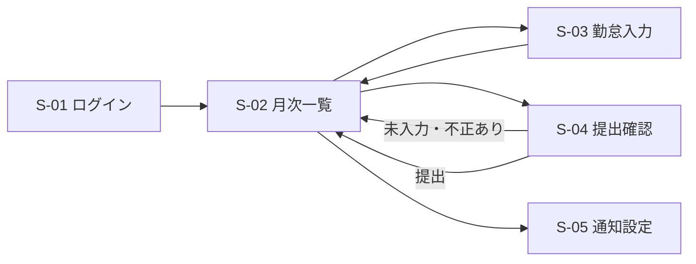
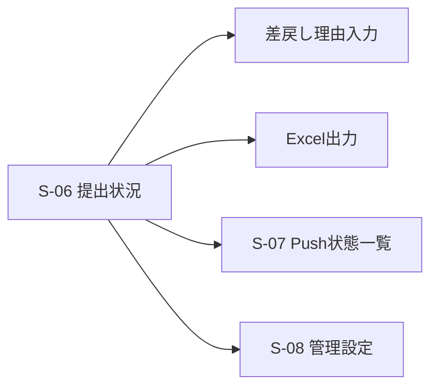

# Clokka 画面設計（Phase 3 レビュー版）

| 項目 | 内容 |
| --- | --- |
| 目的 | 社員が日々の勤怠と月次提出を迷わず行い、管理者が未提出・Push拒否者を把握できる画面要件を定義する。 |
| 対象読者 | プロダクトオーナー、UI実装者、テスト担当者、管理者 |
| 更新タイミング | 画面、導線、入力項目、アクセシビリティ要件を変更する時 |
| 状態 | レビュー・承認待ち |
| 最終更新日 | 2026-08-24 |

## 1. 画面一覧

| ID | 画面 | 利用者 | 主な目的 |
| --- | --- | --- | --- |
| S-01 | ログイン | 全員 | 社員ID・パスワードで安全にログインする。 |
| S-02 | 社員ホーム（月次一覧） | 社員 | 今日の入力、月次進捗、未入力日、提出状態、リマインドを確認する。 |
| S-03 | 勤怠入力 | 社員 | 指定勤務日の出勤・退勤・休憩・備考を登録する。 |
| S-04 | 月次提出確認 | 社員 | 未入力・エラーを確認し、明示的に提出する。 |
| S-05 | 通知設定 | 社員 | ブラウザ通知を許可・拒否した状態を確認し、購読を設定する。 |
| S-06 | 管理ダッシュボード | 管理者 | 月次提出状況を検索、並べ替え、差戻し、Excel出力する。 |
| S-07 | Push通知状態一覧 | 管理者 | Push拒否・未設定・非対応の社員を確認・絞込みする。 |
| S-08 | 管理設定 | 管理者 | 社員、部署、会社休日、提出締切を管理する。 |

## 2. 社員主要フロー

### S-02 社員ホーム

- 最上部に対象月、提出状態、締切までの日数、未入力日数を表示する。
- 締切7日前以降に未提出なら、閉じても次回表示される警告バナーを表示する。
- 日付ごとの行は「未入力」「入力済み」「休日」「提出済みで編集不可」を色だけに依存せず、テキストでも示す。
- 主操作は「今日を入力」「月次提出を確認」。スマホでは画面下部に固定して押しやすくする。

### S-03 勤怠入力

- 勤務日、出勤、退勤、休憩（分）、備考を表示する。時刻は端末のJSTで入力する。
- 退勤が出勤以前なら「翌日退勤として計算」と明示する。
- 保存前に勤務時間見込みを表示し、24時間以上・休憩過大はその場でエラーにする。
- 提出済み月はフォームを編集不可にし、差戻し依頼先を案内する。

### S-04 月次提出確認

- 対象日、入力状況、合計勤務時間、未入力日とエラー理由を一覧化する。
- 問題がある場合は提出ボタンを無効にし、対象日入力へのリンクを表示する。
- 提出ボタンは「内容を確認して提出する」と表記し、確認ダイアログ後に実行する。

## 3. 管理者主要フロー

### S-06 管理ダッシュボード

- 月選択、部署、提出状態、氏名検索、並べ替えを一画面で提供する。
- 一覧列は氏名、部署、未入力日数、提出状態、提出日時、最終更新日時とする。
- 差戻しは理由を必須とし、操作確認後に実行する。
- Excel出力には現在のフィルタ条件を反映し、出力対象件数を実行前に示す。

### S-07 Push通知状態一覧

- 状態フィルタは「すべて / 許可 / 拒否 / 未設定 / 非対応 / 未確認」。
- 社員名、部署、状態、最終報告日時を表示する。個別端末のendpoint等の秘密値は表示しない。
- `拒否`のみで絞り込める。外部連絡機能は初期リリースに含めない（`D-04`）。
- 各状態の意味を一覧上のヘルプで表示する。`許可`は「有効なPush購読登録済み」、`拒否`は「ブラウザで拒否」、`未設定`は「未選択または購読未登録」、`非対応`は「端末・ブラウザ非対応」、`未確認`は「状態未報告」を表す。

## 4. アクセシビリティ・レスポンシブ要件

- 360px幅で横スクロールなしに日次入力・月次提出を行える。
- すべての入力に`label`を関連付け、エラーをテキストで伝える。
- キーボードで全操作でき、フォーカス位置を常に視認できる。
- 色だけで状態を表現せず、アイコン・テキストを併用する。
- ボタンと入力領域は44px以上の操作領域を目標とする。
