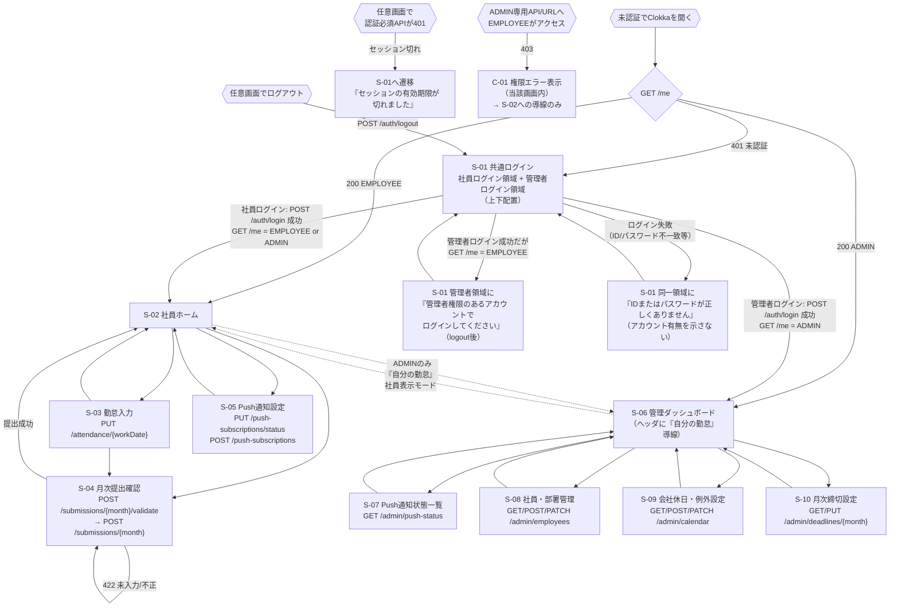
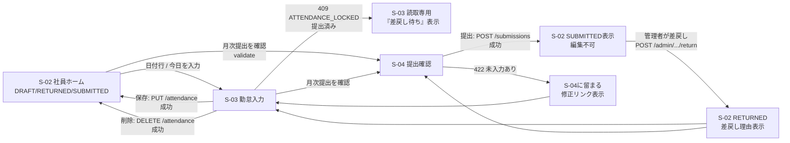
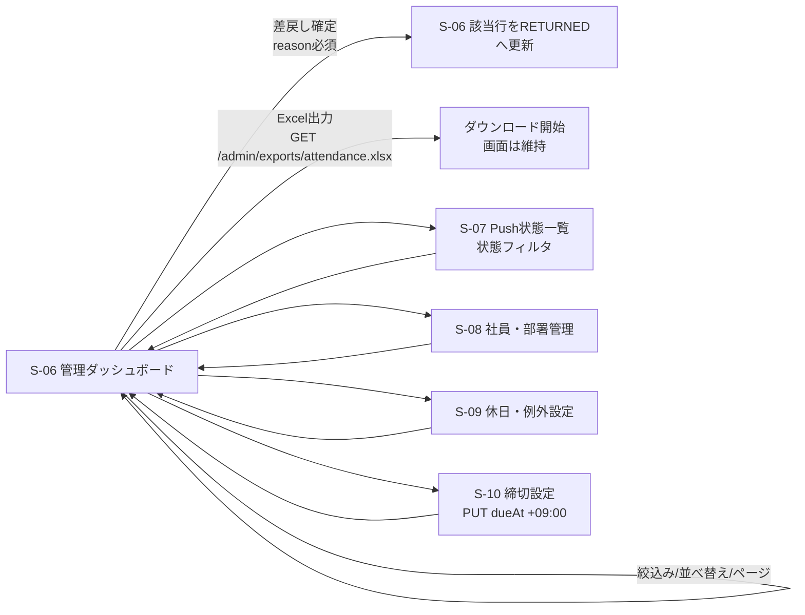

# Clokka 画面設計（Phase 3 レビュー版）

| 項目 | 内容 |
| --- | --- |
| 目的 | 社員が日々の勤怠と月次提出を迷わず行い、管理者が提出状況・Push状態・設定を安全に扱える、実装可能な画面契約を定義する。 |
| 対象読者 | プロダクトオーナー、UI実装者、API実装者、テスト担当者、管理者 |
| 状態 | 承認済み（Q-01 2026-08-28）+ 追補 2026-08-28（Bootstrap/招待/最後のADMIN） |
| 最終更新日 | 2026-08-28 |
| UIモック | `docs/06_screen-design.drawio`（draw.io / diagrams.netで閲覧） |
| 既知の未完了事項 | S-11（招待有効化）はdraw.io/PNGへ未反映（`known-issues.md` KI-015）。本文中の表・フロー・ワイヤーフレーム記述を正本として扱うこと。 |

> **Mermaidとdraw.ioの併用:** 本書では **Mermaidを画面遷移・認証・業務フローの正本**、**draw.ioを各画面UI構造の視覚的正本**として併用する。テキストワイヤーフレームはMarkdown上での補助資料であり、視覚確認の正本はdraw.ioとする。詳細は末尾「8. Mermaidとdraw.ioの役割」を参照。
> **例外:** S-11のみdraw.io/PNGが未作成のため、S-11に関してはMarkdown中の表（1章の画面一覧）・フロー図・ワイヤーフレーム記述を暫定の正本とする（KI-015解消まで）。

## 1. 共通方針

- 未認証でClokkaを開いた時の最初の画面は必ず`S-01 共通ログイン`とする。認証済みで再訪した時は、`GET /me`の権限に応じて社員ホームまたは管理ダッシュボードへ遷移する。
- 認証は既存の`POST /auth/login`、セッションCookie、`GET /me`を使う。社員用・管理者用の入力領域は**UI上の利用目的の区別**であり、別の認証方式・別のアカウント種別・権限昇格を導入しない。
- `EMPLOYEE`は自分の勤怠・月次提出・Push設定だけを利用できる。`ADMIN`は管理画面に加えて、要件表どおり自分自身の社員向け画面を利用できる。管理者は社員表示モードに切り替えても権限を失わず、他社員のデータは社員画面には表示しない。
- 状態変更前にCSRFトークンを取得・送信する。`401`はセッション切れとして`S-01`へ戻し、`403`は現在画面に権限エラーを表示して許可されたホームへのリンクを示す。`404`は対象が非公開または存在しないものとして一覧へ戻す。
- APIが返す日時はUTCでも、画面では業務日・締切・時刻を`Asia/Tokyo`として表示・入力する。時刻表示にブラウザの任意タイムゾーンを用いない。
- ローディング中は操作ボタンを重複実行できない状態にし、成功・失敗の結果は対象画面内のテキスト通知で伝える。Push endpoint、鍵、パスワード、CSRF値は画面・URL・ログ表示に出さない。
- **初期管理者のBootstrapはUIで行わない。** 初回起動時に `BOOTSTRAP_ADMIN_*` 環境変数から1つのトランザクションで `SELECT pg_advisory_xact_lock(hashtext('bootstrap_admin'))` 後に件数検証して冪等に作成され、公開の `/setup` 画面/APIは設けない。`departments` は `V2` で既定の `未所属` がSeedされるため空DBでも実行可能である。社員招待は `S-08` で行い、招待トークンは1回のみ表示して本人が `POST /auth/activate` でパスワードを設定する。再招待時は旧トークンを無効化して新トークンを発行し、初期管理者のパスワード変更は推奨（必須ではなく、専用APIは未定義のため任意）とする。

## 2. 画面一覧

| ID | 画面名 | 対象ユーザー/権限 | 目的 | 主な遷移元 | 主な遷移先 |
| --- | --- | --- | --- | --- | --- |
| S-01 | 共通ログイン | 未認証 | 社員用または管理者用の入口から安全にログインする。 | 初回表示、ログアウト、セッション切れ | S-02、S-06 |
| S-02 | 社員ホーム（月次一覧） | EMPLOYEE、または社員表示モードのADMIN | 自分の月次進捗、未入力日、締切、提出状態、アプリ内警告を確認する。 | S-01、S-03、S-04、S-05 | S-03、S-04、S-05、S-06（ADMINのみ） |
| S-03 | 勤怠入力 | EMPLOYEE、または社員表示モードのADMIN | 自分の指定勤務日の勤怠を登録・修正・削除する。 | S-02 | S-02、S-04 |
| S-04 | 月次提出確認 | EMPLOYEE、または社員表示モードのADMIN | 提出前チェック結果を確認し、月次提出する。 | S-02、S-03 | S-02、S-03 |
| S-05 | Push通知設定 | EMPLOYEE、または社員表示モードのADMIN | 現ブラウザの通知可否と購読状態を報告・登録・論理解除する。 | S-02 | S-02 |
| S-06 | 管理ダッシュボード | ADMIN | 月次提出状況の絞込み、並べ替え、差戻し、Excel出力、管理画面への導線を提供する。 | S-01、S-02 | S-07、S-08、S-09、S-10、S-02 |
| S-07 | Push通知状態一覧 | ADMIN | 社員単位に集約されたPush状態を確認・絞込みする。 | S-06 | S-06 |
| S-08 | 社員・部署管理 | ADMIN | 社員の作成、有効/無効、部署、ロールを管理する。部署マスタ管理はAPI契約確定待ち。 | S-06 | S-06 |
| S-09 | 会社休日・勤務日例外設定 | ADMIN | 会社休日と休日勤務日の例外を月単位で管理する。 | S-06 | S-06 |
| S-10 | 月次締切設定 | ADMIN | 対象月の締切をJSTで確認・更新する。 | S-06 | S-06 |
| S-11 | 招待有効化 | 未認証（招待トークン保持者） | 招待トークンと新パスワードで社員を有効化し、ログイン可能にする。 | 招待URL | S-01 |
| C-01 | 共通エラー状態 | 全員 | セッション切れ、権限不足、対象非公開、通信失敗を一貫して表示する。 | 全画面 | S-01、S-02、S-06、直前画面 |

## 3. 画面遷移と認証・権限制御

### 3.0 Mermaidによる全体遷移図（復活・正本）

> **本節のMermaidは画面遷移・認証・権限分岐の正本。** 表（3.1/3.2）は同内容の詳細表であり、矛盾する場合はMermaidと表をともに修正する。

#### 全体遷移（認証分岐と管理/社員の往来）



#### 社員フロー詳細（勤怠→提出→差戻し）



#### 管理フロー詳細（絞込み→差戻し→Excel/設定）



### 3.1 ログインと共通遷移

| 起点 | 操作/API結果 | 遷移または画面状態 | エラー時 |
| --- | --- | --- | --- |
| 未認証でアプリを開く | `GET /me`が`401` | S-01を表示する。 | 初期読込失敗はS-01内に再試行表示。 |
| S-01社員ログイン | `POST /auth/login`成功後、`GET /me`がEMPLOYEEまたはADMIN | S-02へ。ADMINにはヘッダーに「管理画面」導線を表示する。 | 認証失敗は社員ログイン領域だけに同一の認証失敗文言を表示する。 |
| S-01管理者ログイン | `POST /auth/login`成功後、`GET /me`がADMIN | S-06へ。 | 認証失敗は管理者ログイン領域だけに同一の認証失敗文言を表示する。 |
| S-01管理者ログイン | 認証成功だが`GET /me`がEMPLOYEE | `POST /auth/logout`後、S-01の管理者領域に「管理者権限のあるアカウントでログインしてください」を表示する。 | 社員ホームへ自動遷移しない。 |
| 任意画面 | ログアウト | `POST /auth/logout`後にS-01へ。 | 失敗してもローカル画面から機密値を消し、S-01へ遷移する。 |
| 認証必須API | `401` | S-01へ戻し「セッションの有効期限が切れました。再度ログインしてください。」を表示する。 | 元の入力値・パスワードは復元しない。 |
| ADMIN専用API/URL | EMPLOYEEが`403` | C-01を当該画面内に表示し、S-02へ戻る導線だけを示す。 | 管理データの一部も表示しない。 |
| 自分以外の社員データ | EMPLOYEEがURL等で指定 | APIの`403`/`404`に従いC-01を表示する。 | 対象の氏名や存在を表示しない。 |

### 3.2 業務遷移

| 画面 | 操作 | API | 成功時 | 業務/通信エラー時 |
| --- | --- | --- | --- | --- |
| S-02 | 日付行または「今日を入力」 | `GET /attendance`済みデータを使用 | S-03へ。 | 対象月取得失敗は再試行表示。 |
| S-03 | 保存 | `PUT /attendance/{workDate}` | S-02へ戻り、該当日を入力済みとして再読込。 | 入力エラーはフォーム項目下、`409`は編集不可表示、`401/403`は共通処理。 |
| S-03 | 削除を確定 | `DELETE /attendance/{workDate}` | S-02へ戻り、該当日を未入力として再読込。 | `409`は提出済みロックを表示。 |
| S-02/S-03 | 「月次提出を確認」 | `POST /submissions/{month}/validate` | S-04へ、対象日別の検証結果を表示。 | `422`はS-04に留まり、修正対象へのリンクを表示。 |
| S-04 | 「内容を確認して提出する」を確認 | `POST /submissions/{month}` | S-02へ戻り、`SUBMITTED`と提出日時を表示。 | `422`はS-04に留まり再検証結果を表示。`409`はS-02を再読込。 |
| S-02 | Push通知設定 | `GET /me`の集約状態を表示 | S-05へ。 | 読込失敗はS-05内で再試行。 |
| S-05 | 許可状態を報告/購読登録 | `PUT /push-subscriptions/status`、`POST /push-subscriptions` | S-05に成功表示後、状態を再取得する。 | ブラウザ拒否・未対応は該当状態と説明を表示。 |
| S-05 | 購読解除を確定 | `DELETE /push-subscriptions/{id}` | S-05に`DEFAULT`として成功表示。 | 現ブラウザの購読ID取得契約が未定のため、実装前にAPI設計の解消が必要。 |
| S-06 | 絞込み・並べ替え・ページ移動 | `GET /admin/submissions` | 同画面の一覧を更新。 | 条件を保持して一覧上部に再試行表示。 |
| S-06 | 差戻しを確定 | `POST /admin/submissions/{employeeId}/{month}/return` | 同画面の該当行を`RETURNED`へ更新。 | 理由不足はダイアログ内、状態競合は一覧再読込。 |
| S-06 | Excel出力 | `GET /admin/exports/attendance.xlsx` | ダウンロードを開始し、画面は維持。 | 失敗を一覧上部へ表示。 |
| S-06 | 管理メニューを選択 | 対応する管理API | S-07〜S-10へ。 | `403`は共通処理。 |
| S-07 | 状態フィルタ | `GET /admin/push-status` | 同画面の一覧を更新。 | 同画面に再試行表示。 |
| S-08 | 社員作成・更新・無効化（招待） | `POST /admin/employees`（招待）/`PATCH /admin/employees/{id}`（昇格/無効化） | 招待成功時は招待URLを1回のみ表示し、結果を一覧に反映。 | 招待は `employee_code` 重複で `409`、最後のADMINの降格/無効化は `409 LAST_ADMIN_RESTRICTION`。 |
| S-09 | 休日/例外を保存 | `GET/POST/PATCH /admin/calendar` | 同画面の月表示を更新。 | 日付・種別エラーをフォームに表示。 |
| S-10 | 締切を保存 | `PUT /admin/deadlines/{month}` | 同画面とS-02の締切表示を更新。 | JSTオフセットなし・過去日時等は項目エラー。 |
| S-11 | 有効化を実行 | `POST /auth/activate` | S-01へ遷移し「有効化しました。ログインしてください」を表示。 | トークン不明は `404`、期限切れ/使用済みは `410` で再発行を案内。 |

## 4. UIモック（draw.io）とワイヤーフレーム

### 4.0 draw.io UIモック（視覚的正本）

- **ファイル:** `docs/06_screen-design.drawio`
- **開き方:** diagrams.net（https://app.diagrams.net/）で当該ファイルを開く、または VS Code の Draw.io Integration 拡張で開く。
- **形式:** `mxfile`（複数ダイアグラム）。各ダイアグラムが1画面（またはPC/SP variant）に対応する。
- **目的:** Phase 3で「実際にブラウザを開いた利用者が何をどこに見るか」を人間が視覚確認する。完成版UIではなく、ヘッダー/入力/ボタン/表/カード/エラー/モーダル等の**構造と配置**を過度な装飾なしに示す。

| ダイアグラム名 | 対応画面 | 主な要素 |
| --- | --- | --- |
| S-01 共通ログイン (PC) | S-01 PC | Clokkaタイトル、社員ログイン領域（ID/パスワード/ボタン/エラー）、管理者ログイン領域（同）、上下配置注記 |
| S-01 共通ログイン (SP) | S-01 SP | 同内容を360px幅で縦積み・全幅表示 |
| S-02 社員ホーム (PC) | S-02 PC | ヘッダ、提出状態/締切、未提出バナー、要約、日別表（状態/勤務時間/操作） |
| S-02 社員ホーム (SP) | S-02 SP | 同内容をカード表示、下部固定の提出ボタン |
| S-03 勤怠入力 | S-03 | 勤務日(表示専用)、出退勤、休憩、備考、見込み時間、保存/削除、戻る |
| S-04 月次提出確認 | S-04 | 対象月/締切/状態、差戻し理由、未入力項目、提出ボタン、確認モーダル |
| S-05 Push通知設定 | S-05 | 集約状態、現ブラウザ状態、許可/再確認/解除ボタン、説明 |
| S-06 管理ダッシュボード | S-06 | ヘッダ、管理メニュー、フィルタ、Excel出力、一覧、差戻しモーダル |
| S-07 Push通知状態一覧 | S-07 | フィルタ、氏名/部署/状態/最終報告日時、ヘルプ（鍵非表示注記） |
| S-08 社員・部署管理 | S-08 | 社員一覧、操作（編集/無効化）、履歴非削除注記 |
| S-09 会社休日・例外設定 | S-09 | 月選択、カレンダー一覧、追加ボタン |
| S-10 月次締切設定 | S-10 | 対象月、締切日/時刻(JST)、既定値注記、保存 |

> **更新運用:** UI構造を変更した際は `docs/06_screen-design.drawio` の該当ダイアグラムを更新し、本Markdownの「4.1 テキストワイヤーフレーム」も必要に応じて同期する。HTML/CSS/JSは実装しない。

### 4.1 主要ワイヤーフレーム（テキスト・補助資料）

> **位置づけ:** 本節のテキスト図はMarkdown上で差分レビューしやすくするための**補助資料**。視覚的正本は `docs/06_screen-design.drawio` とする。draw.ioで十分な情報が得られる場合は本節を参照補助として読む。

#### S-01 共通ログイン

```text
PC: 中央幅 440px 前後。2領域は上下に並べ、境界と見出しで区別する。

┌────────────────────────────────────────┐
│                  Clokka                 │
│              勤怠・月次提出             │
│                                        │
│  ┌─ 社員ログイン ───────────────────┐  │
│  │ 社員ID       [                    ] │  │
│  │ パスワード   [                    ] │  │
│  │ [ 社員としてログイン             ] │  │
│  │ 社員ログインのエラー表示領域       │  │
│  └──────────────────────────────────┘  │
│                                        │
│  ┌─ 管理者ログイン ──────────────────┐ │
│  │ 管理者ID     [                    ] │ │
│  │ パスワード   [                    ] │ │
│  │ [ 管理者としてログイン           ] │ │
│  │ 管理者ログインのエラー表示領域     │ │
│  └──────────────────────────────────┘ │
└────────────────────────────────────────┘

スマートフォン: 幅360px以上で1列。両領域を同じ順序で縦積みし、
入力とボタンは全幅、領域間は24px以上空ける。横並び・タブ切替にはしない。
```

#### S-02 社員ホーム

```text
┌────────────────────────────────────────────────────────┐
│ Clokka | 2026年8月 [前月] [次月] | 通知設定 | ログアウト │
│ 提出状態: DRAFT   締切: 2026/09/03 23:59 JST              │
│ [未提出: 締切まで7日。月次提出を確認してください]          │
├────────────────────────────────────────────────────────┤
│ 未入力 3日 | 合計勤務時間 132:30 | [ 月次提出を確認 ]     │
│ 日付       状態          勤務時間             操作         │
│ 08/03(月)  入力済み      08:00                [編集]       │
│ 08/04(火)  未入力        -                    [入力]       │
│ 08/11(火)  会社休日      -                    -             │
└────────────────────────────────────────────────────────┘
```

#### S-03 勤怠入力

```text
┌──────────────────────────────────┐
│ ← 2026/08/04 の勤怠入力           │
│ 勤務日          2026/08/04 (JST)  │
│ 出勤時刻        [09:00]           │
│ 退勤時刻        [18:00]           │
│ 休憩（分）      [60    ]           │
│ 備考            [                ]│
│ 見込み勤務時間  08:00             │
│ 項目別エラー表示領域               │
│ [保存]                 [削除]      │
└──────────────────────────────────┘
```

#### S-04 月次提出確認

```text
┌────────────────────────────────────────┐
│ ← 2026年8月の提出確認                   │
│ 提出状態: RETURNED                      │
│ 差戻し理由: 8/04の時刻を確認してください │
│ 合計勤務時間: 160:30                    │
│ 未入力・不正項目                         │
│ ・08/04 [勤怠を入力]                     │
│ [内容を確認して提出する]                 │
│ 検証・送信エラー表示領域                 │
└────────────────────────────────────────┘
```

#### S-06 管理ダッシュボード

```text
┌────────────────────────────────────────────────────────────┐
│ Clokka 管理 | [自分の勤怠] [Push状態] [設定] [ログアウト]    │
│ 月 [2026-08] 部署 [すべて] 状態 [すべて] 氏名 [      ] [検索] │
│ [Excel出力]  対象: 42名                                      │
├────────────────────────────────────────────────────────────┤
│ 氏名   部署   未入力日  提出状態   提出日時       操作         │
│ 山田   開発   0日       SUBMITTED  09/01 10:12  [差戻し]       │
│ 佐藤   総務   3日       DRAFT      -             -             │
│ ...                                                        │
│ [前へ] 1 / 3 [次へ]                                         │
└────────────────────────────────────────────────────────────┘
```

#### S-07 Push通知状態一覧 / S-10 月次締切設定

```text
┌─────────────────────────────────────────────┐
│ Push通知状態 | 状態 [拒否] [検索]            │
│ 氏名   部署   状態    最終報告日時            │
│ 佐藤   総務   拒否    08/20 09:10 JST         │
│ ※ endpoint・鍵・端末識別情報は表示しない     │
└─────────────────────────────────────────────┘

┌─────────────────────────────────────────────┐
│ 月次締切設定                                 │
│ 対象月 [2026-08]                             │
│ 締切日 [2026/09/03] 時刻 [23:59] JST         │
│ [保存]                                       │
│ 入力・保存エラー表示領域                     │
└─────────────────────────────────────────────┘
```

## 5. 各画面のUI仕様

### S-01 共通ログイン

| 項目 | 仕様 |
| --- | --- |
| 目的/権限 | 未認証利用者が本人のロールでログインする。 |
| 入力 | 各領域に社員ID/管理者ID（いずれもAPI上は社員ID）とパスワード。`autocomplete`はIDに`username`、パスワードに`current-password`を指定する。 |
| 操作 | 各領域の専用ログインボタン。Enterはフォーカス中の領域だけを送信する。パスワード表示切替はアイコンボタンとラベルを持つ。 |
| バリデーション | 空欄は送信せず対象項目下に表示。認証失敗はアカウント有無を示さない共通文言。送信中は同一領域のボタンを無効化する。 |
| 成功/エラー | 成功後は`GET /me`のロールで遷移する。管理者領域にEMPLOYEEが入った場合だけログアウトして同領域に権限エラーを表示する。 |
| PC/スマホ | PCは中央固定幅、スマホは全幅縦積み。両ログイン領域を同時に見せ、意図しない管理者ログイン選択を避ける。 |

### S-02 社員ホーム

| 項目 | 仕様 |
| --- | --- |
| 目的/権限 | 自分の対象月の勤怠、提出状態、未入力日、合計勤務時間、締切を確認する。EMPLOYEEとADMINの自分用画面。 |
| レイアウト/表示 | ヘッダー、月移動、状態・締切・未入力件数の要約、締切7日前以降の未提出警告、日別一覧。休日・未入力・入力済み・提出済みを文言とアイコンで表示する。 |
| 操作 | 今日を入力、日付別入力、月移動、月次提出確認、Push通知設定、ログアウト。ADMINだけは管理画面リンクを表示する。 |
| バリデーション/状態 | `SUBMITTED`は編集リンクを無効表示し、提出日時を示す。`RETURNED`は差戻し理由を要約表示する。月未作成は既存設計どおり画面上`DRAFT`として表示する。 |
| 成功/エラー | 保存・提出・解除から戻ったら対象月を再取得。APIエラーは一覧を消さず、上部のライブ領域に表示する。 |
| PC/スマホ | PCは表形式。スマホは日付ごとのカードまたは2列情報にし、操作を右端ではなく行内下部へ置く。主要操作は画面下部固定を許容する。 |

### S-03 勤怠入力

| 項目 | 仕様 |
| --- | --- |
| 目的/権限 | 自分の1勤務日を入力する。EMPLOYEEとADMINの自分用画面。 |
| 入力 | 勤務日（表示専用）、出勤時刻、退勤時刻、休憩分、備考。勤務日はURL値と表示値を一致させ、ユーザーは変更できない。 |
| バリデーション | 時刻必須、休憩は0以上の整数、24時間未満、休憩は経過時間未満。退勤が出勤以前なら翌日退勤として見込み計算を明示する。複数回出退勤は入力させない。 |
| 操作 | 保存、既存記録がある場合のみ削除、戻る。削除は確認ダイアログを必須とする。 |
| 成功/エラー | 保存/削除成功はS-02へ戻る。`409 ATTENDANCE_LOCKED`はフォームを読取専用にし、差戻し待ちを表示する。 |
| PC/スマホ | 入力は単列、時刻はネイティブ時刻入力を基本とする。44px以上の操作領域を確保する。 |

### S-04 月次提出確認

| 項目 | 仕様 |
| --- | --- |
| 目的/権限 | 自分の提出対象日・未入力・不正値・合計を確認して明示提出する。 |
| 表示 | 対象月、締切、提出状態、提出日時、差戻し理由、対象日別の入力状態、合計勤務時間、検証結果。 |
| 操作 | 対象日ごとの「勤怠を入力」、戻る、提出。提出は確認ダイアログに対象月と「提出後は編集できない」を明示する。 |
| バリデーション | 画面遷移時と提出直前に`validate`を行う。未入力・不正値があれば提出ボタンを無効にし、修正導線を表示する。 |
| 成功/エラー | 成功はS-02で`SUBMITTED`を表示。`422`はS-04に留まり結果を更新、`409`は状態を再読込する。 |
| PC/スマホ | 対象日一覧はPC表、スマホカード。提出ボタンは画面末尾に固定幅で表示する。 |

### S-05 Push通知設定

| 項目 | 仕様 |
| --- | --- |
| 目的/権限 | 現ブラウザの通知状態を報告し、許可済みなら購読を登録、解除時は論理解除する。 |
| 表示 | 社員単位の集約状態、現在のブラウザの対応可否・Permission状態、Pushが提出漏れ防止の補助手段である説明。 |
| 操作 | 通知を許可して登録、状態を再確認、購読を解除。外部連絡機能は表示しない。 |
| バリデーション | 非対応は許可ボタンを表示しない。ブラウザで拒否済みならOS/ブラウザ設定で変更する案内のみ表示する。購読未登録の`GRANTED`は`DEFAULT`として表示する。 |
| 成功/エラー | 成功後に集約状態を更新。解除は暗号化購読データを消去する論理解除であることを確認ダイアログに示す。 |
| 制約 | 現行APIは解除に`id`を要求するが、現在ブラウザの購読ID取得方法を定義していない。この画面の解除ボタンはAPI契約解消まで実装保留とする。 |
| PC/スマホ | 説明、状態、主操作を単列に置く。ブラウザ権限ダイアログの背後に操作を隠さない。 |

### S-06 管理ダッシュボード

| 項目 | 仕様 |
| --- | --- |
| 目的/権限 | ADMINが月次提出状況を確認し、差戻し・Excel出力・設定画面へ進む。 |
| 表示/入力 | 対象月、部署、提出状態、氏名検索、ソート順、ページ、氏名、部署、未入力日数、提出状態、提出日時、最終更新日時。 |
| 操作 | 検索、並べ替え、ページ移動、差戻し、Excel出力、Push状態、社員・部署管理、休日設定、締切設定、自分の勤怠、ログアウト。 |
| バリデーション | 月・状態・ソート値は許可リストから選ぶ。差戻し理由はトリム後1文字以上必須。Excelは現在のフィルタと対象件数を表示してから実行する。 |
| 成功/エラー | 差戻し成功後は一覧再読込。差戻し状態競合は行を更新して再操作を促す。Excel失敗はダウンロード画面へ遷移せず通知する。 |
| 制約 | 既存APIは提出状態・未入力日数の一覧を提供するが、他社員の各日勤怠明細を返すAPIはない。要件上必要な「他社員の勤怠閲覧」の明細画面はAPI契約確定まで追加しない。 |
| PC/スマホ | PCは密度の高い表。スマホはフィルタを折りたたみ、行をカード化し、差戻しは各カードのメニューから開く。 |

### S-07〜S-10 管理画面

| 画面 | UI仕様 |
| --- | --- |
| S-07 Push通知状態一覧 | 状態（すべて/許可/拒否/未設定/非対応/未確認）で絞込み、氏名・部署・状態・最終報告日時を表示する。endpoint、購読鍵、設置IDは絶対に表示しない。スマホは行カード化する。 |
| S-08 社員・部署管理 | 社員一覧、氏名、社員ID、部署、ロール、有効状態、招待/昇格/無効化を表示する。`POST` は `employee_code`/`display_name`/`department_id`/`role` のみを受け取り、パスワードは受け取らない。作成時は `is_active=false` で招待トークンを発行し、平文URLを1回のみモーダルで表示して本人へ手渡す。`PATCH` で `role` または `is_active` を変更する際、最後の有効ADMINが0人になる場合はAPIが `409 LAST_ADMIN_RESTRICTION` で拒否し、UIでも該当行の降格/無効化ボタンを無効化して理由をツールチップで示す。無効化は履歴を削除しない。招待トークンは24時間で失効し、再発行は管理者が再招待で発行する。 |
| S-09 会社休日・勤務日例外設定 | 月選択とカレンダー一覧に、日付、種別（休日/勤務日例外）、名称を表示する。追加・編集操作は日付、種別、名称を必須とし、同一日付の二重登録を防ぐ。 |
| S-10 月次締切設定 | 対象月、JST日付、時刻、既定値（翌月3日23:59 JST）を表示する。保存時はJSTオフセット付き日時で送信し、成功後は保存済みの締切を再表示する。 |
| S-11 招待有効化 | 招待URLからトークンと新パスワード（確認含む）を入力し `POST /auth/activate` で有効化する。成功時は `S-01` へ遷移してログインを促す。トークンは1回限り・24時間で失効し、失敗時は `404`/`410` に応じた再発行案内を表示する。 |

## 6. レスポンシブ・アクセシビリティ

- 360px幅以上で横スクロールなしに、ログイン、勤怠入力、提出、Push設定を完了できる。管理一覧はカード化または列の折りたたみで対応し、データ表全体の横スクロールを常用しない。
- すべての入力に可視ラベルを関連付ける。エラーは対象入力の直後と画面先頭の要約でテキスト表示し、フォーカスを最初のエラーへ移す。
- 状態は色だけに依存せず、文言・アイコン・必要に応じてパターンを併用する。キーボード操作、可視フォーカス、44px以上の主要操作領域を確保する。
- ダイアログはEscで閉じ、フォーカスを開いた操作へ戻す。ただし提出・差戻し・削除の確認ダイアログは、実行中に閉じたり二重実行したりできない。
- 画面幅でフォントサイズを拡大縮小しない。長い氏名・差戻し理由は折り返し、日時はJST表記を崩さない。

## 7. API契約の未解決事項

画面設計から新しいAPIは追加しない。次の既存要件/API間の不足は、実装前にAPI設計レビューで解消する必要がある。

1. 要件は管理者による他社員勤怠の閲覧を認めるが、`05_api.md`には日別勤怠明細を取得する管理者APIと応答契約がない。
2. `DELETE /push-subscriptions/{id}`に必要な、現ブラウザの購読`id`を取得・保持・再発見するAPI契約がない。
3. 部署管理は要件にあるが、部署マスタを取得・作成・更新する管理APIがない。社員作成・更新・初期パスワード設定のリクエスト/レスポンス項目も未定である。

これらは要件変更ではない。要件を満たすためのAPI詳細化またはAPI追加の承認が必要であり、UI実装で推測して補ってはならない。

## 8. Mermaidとdraw.ioの役割

| 区分 | 役割 | 正本 | 用途 |
| --- | --- | --- | --- |
| Mermaid（本書3.0） | 画面間の遷移・認証・業務フローを表現する | 本Markdown内のMermaid図 | 遷移・権限分岐・エラー時遷移のレビュー。表（3.1/3.2）と相互補完し、矛盾時は両方を修正する。 |
| draw.io（`docs/06_screen-design.drawio`） | 各画面で利用者が見るUIの構造・配置を視覚化する | `docs/06_screen-design.drawio` の各ダイアグラム | 人間が「何をどこに見るか」を視覚確認。色や装飾は作り込まず、ヘッダー/入力/ボタン/表/カード/エラー/モーダルの構造を示す。 |
| テキストワイヤーフレーム（本書4.1） | Markdown上での差分レビュー補助 | 補助資料 | draw.ioの代替ではなく、Git差分でのレビュー補助。視覚確認の正本はdraw.io。 |

両者は置き換え関係ではなく、Phase 3で併用する。Mermaidを削除してdraw.ioに置き換えることはしない。
